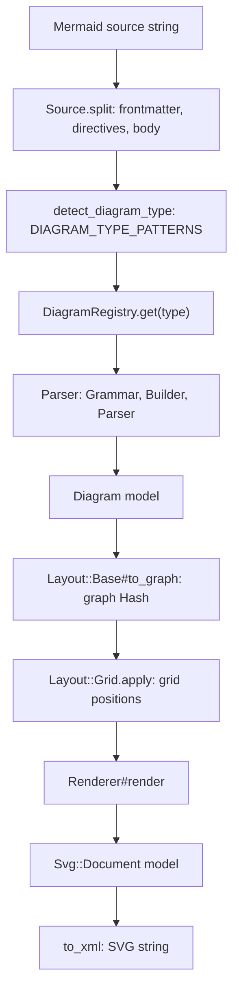
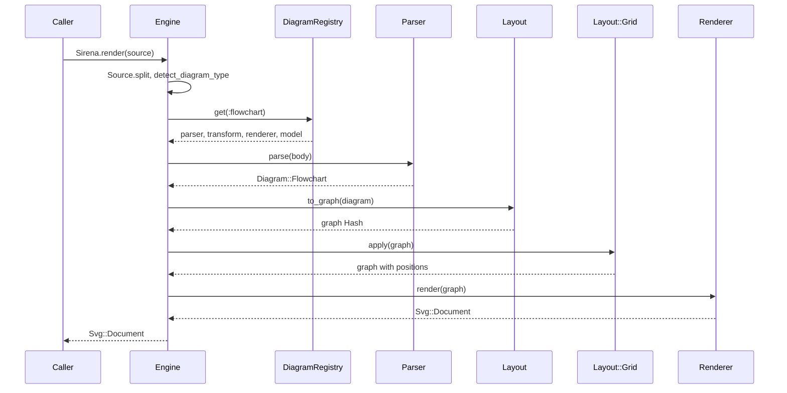
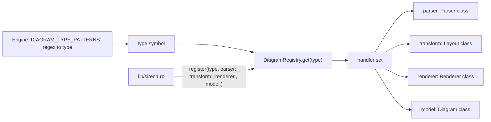

# Sirena Architecture

## Overview

Sirena is a pure Ruby implementation of Mermaid diagram generation following
strict object-oriented principles with model-driven architecture. The system
transforms Mermaid syntax into SVG output through a pipeline of well-separated
components.

## Core Principles

1. **Model-Driven Design**: Every registered diagram model inherits
   `Diagram::Base`, which is a `Lutaml::Model::Serializable`. Some value
   classes nested inside them are plain Ruby — `RadarAxis`, `TreemapNode`
   and `PacketField`
2. **MECE Separation**: Each component has mutually exclusive, collectively
   exhaustive responsibilities
3. **Register-Based**: Diagram types and renderers registered dynamically
4. **Open/Closed**: Extensible without modification via inheritance/composition
5. **Single Responsibility**: Each class handles one cohesive concern

## Processing Pipeline

`Engine#render` (`lib/sirena/engine.rb`) runs a fixed pipeline. Layout
currently uses a built-in fallback grid (`Layout::Grid`); elkrb is a
declared dependency but is not called yet (see the TODO in
`Engine#layout_graph`).



Each stage raises its own `Sirena::Error` subclass (`Engine::DiagramTypeError`,
`Parser::ParseError`, `Layout::LayoutError`, `Renderer::RenderError`);
`Engine#render` wraps anything else in `Engine::PipelineError`.

## Component Architecture

```
Sirena (Root Module)
    │
    ├── Engine (Orchestrator)
    │     │
    │     ├── coordinates overall flow
    │     ├── delegates to Parser
    │     ├── delegates to Layout
    │     └── delegates to Renderer
    │
    ├── Parser (Syntax Analysis - Parslet-based)
    │     │
    │     ├── Grammars (Parslet syntax rules)
    │     ├── Builders (Parslet tree transformations)
    │     ├── Parsers (orchestrate Grammar → Builder)
    │     └── produces Diagram Models
    │
    ├── Diagram (Domain Models)
    │     │
    │     ├── Base (Abstract)
    │     └── one model per registered type (24; see lib/sirena.rb)
    │
    ├── Layout (Model Conversion)
    │     │
    │     ├── Base (Abstract)
    │     └── one layout per registered type
    │
    ├── Renderer (SVG Generation)
    │     │
    │     ├── Base (Abstract)
    │     └── one renderer per registered type
    │
    ├── Svg (SVG Models)
    │     │
    │     ├── Document
    │     ├── Element
    │     ├── Group
    │     ├── Path
    │     ├── Text / Tspan
    │     ├── Rect
    │     ├── Circle / Ellipse
    │     ├── Line / Polyline
    │     ├── Polygon
    │     └── Style
    │
    ├── DiagramRegistry (Type Registration)
    │     │
    │     ├── register(type, parser:, transform:, renderer:, model:)
    │     └── get(type) -> handler triple
    │
    └── TextMeasurement (Dimension Calculation)
          │
          ├── TextMeasurement.measure(text, font_size:, width: nil, height: nil)
          └── character-based approximations
```

## Parslet-Based Parser Architecture

All 24 registered diagram types are parsed with Parslet
(`plurimath-parslet`) grammars. There is no lexer-based parser in `lib/`.

### 3-Layer Parslet Architecture

Most parsers follow a 3-layer pattern (a few types, e.g. user_journey,
define the grammar and transform inline in the parser file):

```
┌─────────────────────────────────────────────┐
│  Layer 1: Grammar (Parslet::Parser)        │
│  ────────────────────────────────────       │
│  • Defines syntax rules using Parslet DSL  │
│  • Parses text into intermediate tree      │
│  • Returns Hash/Array structures           │
│                                             │
│  File: lib/sirena/parser/grammars/*.rb     │
└────────────┬────────────────────────────────┘
             │
             ▼ Intermediate tree (Hash/Array)
┌─────────────────────────────────────────────┐
│  Layer 2: Builder (10 of 23 Parslet)       │
│  ──────────────────────────────────────     │
│  • Converts intermediate tree to models    │
│  • Maps patterns to Diagram objects        │
│  • Returns structured Diagram models       │
│                                             │
│  File: lib/sirena/parser/builders/*.rb     │
└────────────┬────────────────────────────────┘
             │
             ▼ Diagram models (Lutaml::Model::Serializable)
┌─────────────────────────────────────────────┐
│  Layer 3: Parser (Orchestrator)            │
│  ────────────────────────────────────       │
│  • Combines Grammar + Builder              │
│  • Public API: parse(input) → Diagram      │
│  • Handles errors and edge cases           │
│                                             │
│  File: lib/sirena/parser/*.rb              │
└─────────────────────────────────────────────┘
```

### Benefits of Parslet Architecture

1. **Superior Error Messages**: Parslet provides detailed context and line
   numbers for syntax errors, making debugging much easier.

2. **Composability**: Grammar rules can be composed and reused across diagram
   types through the Common grammar module.

3. **Maintainability**: The 3-layer separation makes code easier to understand,
   test, and modify.

4. **Declarative Syntax**: Grammar rules are declarative and self-documenting,
   making the parser logic clear and concise.

5. **Type Safety**: Most diagram models are typed `Lutaml::Model` objects, so
   bad attribute values fail early.

### Example: Flowchart Parser

```ruby
# Layer 1: Grammar (lib/sirena/parser/grammars/flowchart.rb)
module Sirena::Parser::Grammars
  class Flowchart < Common  # Common holds the shared rules
    root(:diagram)
    # ... rules
  end
end

# Layer 2: Builder (lib/sirena/parser/builders/flowchart.rb)
module Sirena::Parser::Builders
  class Flowchart < Parslet::Transform
    # ... rules that build Diagram::Flowchart
  end
end

# Layer 3: Parser (lib/sirena/parser/flowchart.rb)
class Sirena::Parser::Flowchart < Sirena::Parser::Base
  def parse(source)
    source = normalize_line_ends(source)
    Builders::Flowchart.apply(parse_with_grammar(Grammars::Flowchart.new, source))
  end
end
```

## Data Flow Details

### 1. Parsing Phase (Parslet-based)

```
Mermaid Source
      │
      ▼
   Grammar.parse
   (Parslet rules)
      │
      ▼
 Intermediate Tree
  (Hash/Array)
      │
      ▼
  Builder.apply
  (Pattern matching)
      │
      ▼
   Diagram Model
   (Lutaml::Model, most types)
```

The parser produces typed diagram models that fully represent the diagram
structure. Each diagram type has its own Grammar, Builder, and Parser classes
following the consistent 3-layer pattern.

### 2. Graph Build Phase

```
Diagram Model
      │
      ▼
Layout::Base#to_graph  (validates, then build_graph)
      │
      ├── Build nodes and edges as an ELK-shaped Hash
      ├── Apply text measurement for dimensions
      └── Set layout options
      │
      ▼
  Graph (Hash)
```

`Layout::Base#to_graph` delegates to `#call`, which raises
`LayoutError` for an invalid diagram and otherwise calls the
subclass's `#build_graph`. The graph is a plain Hash in the shape elkrb
takes; it is not an `Elkrb::Graph` object. Heterogeneous per type: some
layouts emit pre-positioned structures.

### 3. Layout Phase

```
Graph (Hash)
      │
      ▼
Layout::Grid.apply
      │
      └── Place children on a fixed-column grid
      │
      ▼
Laid Out Graph
(with x, y coordinates)
```

`Engine#layout_graph` calls `Layout::Grid.apply`. elkrb is a declared
dependency but is not called from `lib/`; replacing the fallback with
elkrb is a TODO in `Engine#layout_graph`.

### 4. Rendering Phase

```
Laid Out Graph
      │
      ▼
Renderer.render
      │
      ├── Create SVG::Document
      ├── Add nodes as SVG shapes
      ├── Add edges as SVG paths
      ├── Add labels as SVG text
      └── Apply styles
      │
      ▼
  SVG Model
 (Lutaml::Model)
      │
      ▼
SVG.to_xml
      │
      ▼
  SVG String
```

The renderer converts positioned graph elements into `Svg` model objects;
the XML string comes from their hand-written `to_xml` methods.

## Class Responsibility Matrix

| Component | Responsibility | Dependencies |
|-----------|---------------|--------------|
| `Engine` | Orchestrate entire pipeline | Parser, Layout, Renderer |
| `Parser::Grammars::*` | Define Parslet syntax rules | Parslet, Common |
| `Parser::Builders::*` | Transform parse trees | Parslet::Transform, Diagram models |
| `Parser::*` | Orchestrate Grammar+Builder | Grammars, Builders |
| `Diagram::Base` | Abstract diagram model | Lutaml::Model (most types) |
| `Diagram::*` | Specific diagram structures | Diagram::Base |
| `Layout::Base` | Abstract graph converter | TextMeasurement |
| `Layout::*` | Diagram-specific conversion | Layout::Base, TextMeasurement |
| `Renderer::Base` | Abstract SVG renderer | Svg |
| `Renderer::*` | Diagram-specific rendering | Renderer::Base, Svg |
| `Svg::*` | SVG graphic primitives | Lutaml::Model |
| `DiagramRegistry` | Type handler registration | None |
| `TextMeasurement` | Text dimension calculation | None |

## Extensibility Points

### Adding New Diagram Types

```ruby
# 1. Define diagram model
class Diagram::NewType < Diagram::Base
  attribute :elements, :array
  # ... diagram-specific attributes
end

# 2. Implement transform
class Layout::NewType < Layout::Base
  def build_graph(diagram)
    # Convert diagram to a graph Hash
  end
end

# 3. Implement renderer
class Renderer::NewType < Renderer::Base
  def render(graph)
    # Convert graph to SVG
  end
end

# 4. Register
DiagramRegistry.register(
  :new_type,
  parser: Parser::NewType,
  transform: Layout::NewType,
  renderer: Renderer::NewType,
  model: Diagram::NewType
)

# 5. Add a detection regex to Engine::DIAGRAM_TYPE_PATTERNS
```

### Adding New SVG Shapes

```ruby
# Define new SVG element
class Svg::NewShape < Svg::Element
  attribute :custom_attr, :string

  # Serialized by a hand-written to_xml (see svg/element.rb), not by a
  # Lutaml xml mapping.
  def to_xml
    # ...
  end
end
```

## SVG Builder Architecture

The SVG builder covers the subset of SVG that the renderers emit (rect,
circle, ellipse, line, path, polygon, polyline, text, group; output is
`baseProfile="tiny"`), built on Lutaml::Model. This enables:

1. **Object-Oriented SVG Construction**: Build SVG programmatically
2. **Type Safety**: Strong typing via Lutaml::Model attributes
3. **Serialization**: hand-written `to_xml` methods (e.g. `svg/document.rb`)
4. **Composability**: Nested element structures

```
SVG::Document
    │
    ├── viewBox: String
    ├── width: Numeric
    ├── height: Numeric
    └── children: Array<SVG::Element>
            │
            ├── SVG::Group
            │     ├── transform: String
            │     ├── style: SVG::Style
            │     └── children: Array<SVG::Element>
            │
            ├── SVG::Path
            │     ├── d: String (path data)
            │     └── style: SVG::Style
            │
            ├── SVG::Text
            │     ├── x, y: Numeric
            │     ├── content: String
            │     └── style: SVG::Style
            │
            └── SVG::Rect, Circle, Line, Polygon...
```

## Text Measurement Strategy

Text dimensions are calculated using character-based approximations:

```ruby
TextMeasurement.measure("Hello", font_size: 14)
# => { width: 35.0, height: 14.0 }

# Algorithm:
# - Average character width: font_size * 0.5
# - Height: font_size * 1.0
# - Width: char_count * avg_char_width
# - Users can override with explicit dimensions
```

This provides reasonable estimates for layout without requiring font metrics
libraries. Layouts use these dimensions for node sizing.

## Error Handling

```
Sirena::Error (StandardError)
   │
   ├── Engine::DiagramTypeError
   ├── Engine::PipelineError
   ├── Parser::ParseError
   ├── Layout::LayoutError
   └── Renderer::RenderError
```

Each phase has specific error types for clear debugging and error reporting.

## Testing Strategy

### Unit Tests (Per Class)
- Each model class has structural tests
- Each parser component tests syntax handling
- Each transform tests graph conversion
- Each renderer tests SVG generation

### Integration Tests
- End-to-end: Mermaid syntax → SVG output
- Verify structural correctness of SVG
- Compare with expected fixture outputs
- Manual visual verification

### Fixtures
- Located in `spec/fixtures/`
- One subdirectory per fixtured type (not every registered type has one)
- Input `.mmd` files and expected outputs
- Cover edge cases and complex scenarios

## Directory Structure

```
sirena/
├── lib/
│   └── sirena/
│       ├── version.rb
│       ├── engine.rb
│       ├── diagram_registry.rb
│       ├── text_measurement.rb
│       ├── parser/
│       │   ├── base.rb
│       │   ├── grammars/           # Parslet grammars (Layer 1)
│       │   │   ├── common.rb       # Shared grammar rules
│       │   │   ├── flowchart.rb
│       │   │   ├── class_diagram.rb
│       │   │   ├── er_diagram.rb
│       │   │   ├── state_diagram.rb
│       │   │   └── (other diagram grammars)
│       │   ├── builders/            # Parslet transforms (Layer 2)
│       │   │   ├── flowchart.rb
│       │   │   ├── class_diagram.rb
│       │   │   ├── er_diagram.rb
│       │   │   ├── state_diagram.rb
│       │   │   └── (other diagram transforms)
│       │   ├── flowchart.rb        # Parser orchestrators (Layer 3)
│       │   ├── class_diagram.rb
│       │   ├── er_diagram.rb
│       │   ├── state_diagram.rb
│       │   └── (other diagram parsers)
│       ├── diagram/
│       │   ├── base.rb
│       │   └── (one model per registered type)
│       ├── layout/
│       │   ├── base.rb
│       │   ├── grid.rb
│       │   └── (diagram-specific graph layouts)
│       ├── renderer/
│       │   ├── base.rb
│       │   └── (diagram-specific renderers)
│       ├── svg/
│       │   ├── document.rb
│       │   ├── element.rb
│       │   ├── group.rb
│       │   ├── path.rb
│       │   ├── text.rb
│       │   ├── rect.rb
│       │   ├── circle.rb
│       │   ├── line.rb
│       │   ├── polygon.rb
│       │   └── style.rb   (plus ellipse, polyline, tspan, escaping,
                        arrowhead, numbers, path_geometry)
│       └── cli.rb
├── spec/
│   ├── spec_helper.rb
│   ├── fixtures/
│   │   └── <type>/   (input.mmd, expected.svg)
│   └── (test files mirroring lib/)
└── examples/
    └── <type>/   (NN-name.mmd inputs, generated SVGs)
```

## Component Interaction Sequence

### Example: Rendering a Flowchart



### Detailed Flow

1. **Engine receives mermaid source**
   - Splits frontmatter, directives and body (`Source.split`)
   - Detects diagram type from syntax prefix
   - Looks up handler in DiagramRegistry

2. **Parser processes syntax** (Parslet)
   - Grammar parses input using Parslet rules
   - Builder converts intermediate tree to Diagram model
   - Returns typed Diagram model (Lutaml::Model for most types)

3. **Layout converts to graph**
   - Analyzes diagram structure
   - Builds nodes and edges as a graph Hash
   - Applies TextMeasurement for node dimensions
   - Sets layout options

4. **Layout positions the graph**
   - `Layout::Grid` places children on a grid
   - elkrb is not called yet

5. **Renderer generates SVG**
   - Creates Svg::Document root
   - Adds SVG shapes for each node
   - Adds SVG paths for each edge
   - Adds SVG text for labels
   - Applies styling

6. **Serialization**
   - `Svg::Document#to_xml` returns the XML string

## Key Design Patterns

### Registry Pattern (DiagramRegistry)

Allows dynamic registration and retrieval of diagram type handlers without
hardcoding type checks. Each of the 24 types registers one handler set in
`lib/sirena.rb`; detection is a separate table,
`Engine::DIAGRAM_TYPE_PATTERNS`.



```ruby
DiagramRegistry.register(
  :flowchart,
  parser: Parser::Flowchart,
  transform: Layout::Flowchart,
  renderer: Renderer::Flowchart,
  model: Diagram::Flowchart
)

handlers = DiagramRegistry.get(:flowchart)
diagram = handlers[:parser].new.parse(source)
```

### Strategy Pattern (Layout/Renderer)

Each diagram type has its own transformation and rendering strategy,
implementing a common interface.

```ruby
class Layout::Base
  def build_graph(diagram)
    raise NotImplementedError
  end
end

class Layout::Flowchart < Layout::Base
  def build_graph(diagram)
    # Flowchart-specific conversion
  end
end
```

### Builder Pattern (SVG)

SVG construction uses the builder pattern to create
complex nested structures programmatically.

```ruby
svg = Svg::Document.new(width: 800, height: 600).tap do |doc|
  doc.children << Svg::Group.new.tap do |group|
    group.children << Svg::Rect.new(x: 0, y: 0, width: 100, height: 50)
    group.children << Svg::Text.new(x: 50, y: 25, content: "Node")
  end
end
```

### Template Method Pattern (Base Classes)

Base classes fix the entry point and guards; subclasses fill in the type
specific part. `Layout::Base#call` validates the diagram, then calls the
subclass's `#build_graph`. `Renderer::Base#render` is the abstract entry
point that each renderer implements.

## Dependencies and Their Roles

Declared in `sirena.gemspec`:

- **plurimath-parslet (~> 3.0)**: Parslet fork used to build all diagram grammars
- **lutaml-model (= 0.8.31)**: Serialization framework for the models
- **elkrb**: Declared, not yet called from `lib/` (layout is `Layout::Grid`)
- **kramdown (~> 2.5)**: Markdown label text
- **moxml**: declared, not referenced from `lib/`
- **thor**: CLI framework

## Integration with Metanorma

Sirena's SVG is meant to be embedded in Metanorma documents.
`spec/svg_conformance_spec.rb` validates, against `svg_conform` with
`CONFORMANCE_PROFILE = :metanorma`: the `examples/*.svg` files the gem ships,
the reference fixtures rendered for the 8 types that have an `input.mmd`
under `spec/fixtures/`, and the mermaid-corpus cases that render today (a
named baseline, `spec/mermaid/corpus-renderable.txt`). Corpus cases that do
not render are not checked. The SVG
includes:

- Proper XML namespace declarations
- ViewBox for scalability
- Embedded styling (no external CSS dependencies)
- Standard-compliant path data
- UTF-8 text encoding

Integration point:

```ruby
# In Metanorma document processing
svg_output = Sirena.render(mermaid_diagram_source)
# Embed directly in document
```