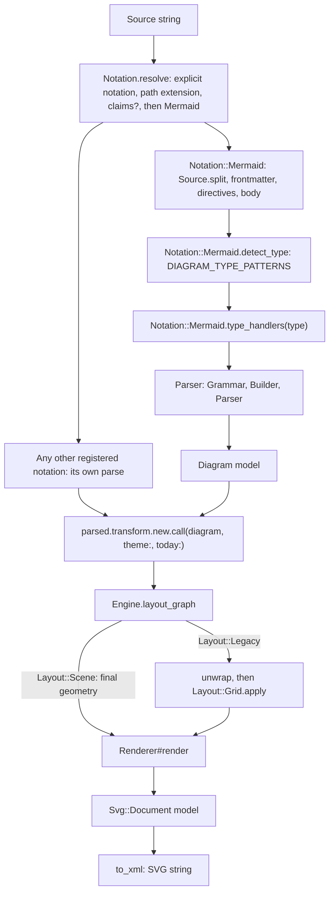
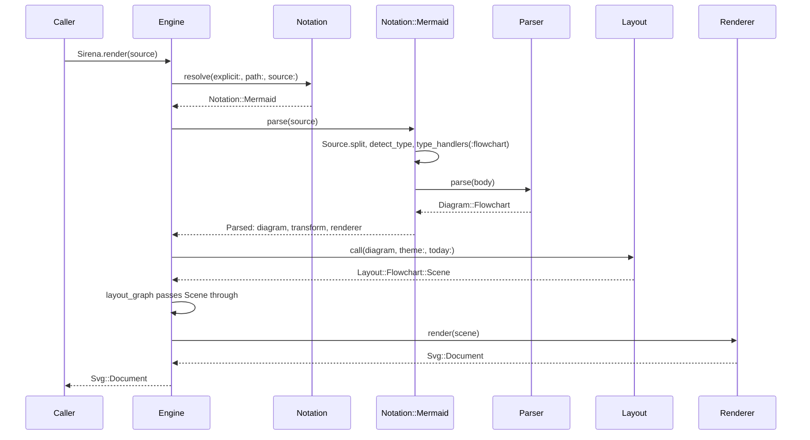
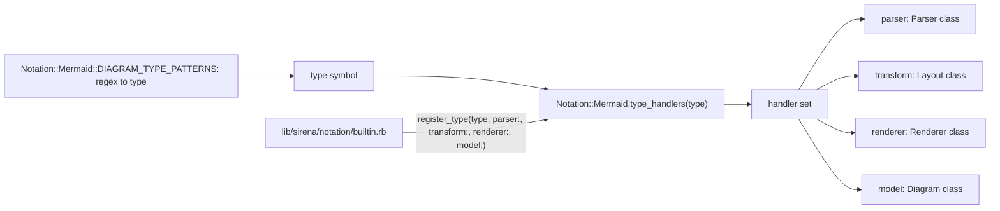

# Sirena Architecture

## Overview

Sirena is a pure Ruby implementation of Mermaid diagram generation following
strict object-oriented principles with model-driven architecture. The system
transforms Mermaid syntax into SVG output through a pipeline of well-separated
components.

## Core Principles

1. **Model-Driven Design**: Every registered diagram model inherits
   `Diagram::Base`, which is a `Lutaml::Model::Serializable`. Six value
   classes nested under `Sirena::Diagram` are plain Ruby: `PacketField`,
   `RadarAxis`, `RadarCurve`, `TreemapNode`, `XYAxis` and `XYDataset`. To
   re-derive that list, select the `Sirena::Diagram` constants that are
   classes and do not descend from `Lutaml::Model::Serializable`
2. **MECE Separation**: Each component has mutually exclusive, collectively
   exhaustive responsibilities
3. **Register-Based**: Diagram types and renderers registered dynamically
4. **Open/Closed**: Extensible without modification via inheritance/composition
5. **Single Responsibility**: Each class handles one cohesive concern

## Processing Pipeline

`Engine#render` (`lib/sirena/engine.rb`) runs a fixed pipeline with a
temporary hybrid layout boundary. Converted layouts return a typed
`Layout::Scene` containing final canvas geometry. Layouts that have not yet
been converted return a Hash wrapped in `Layout::Legacy`; only that branch
passes through the built-in fallback grid (`Layout::Grid`). elkrb is a
declared dependency but is not called from `lib/`.


```mermaid
flowchart TD
    Src["Source string"] --> Pick["Notation.resolve: explicit notation, path extension, claims?, then Mermaid"]
    Pick --> Split["Notation::Mermaid: Source.split, frontmatter, directives, body"]
    Pick --> Other["Any other registered notation: its own parse"]
    Split --> Detect["Notation::Mermaid.detect_type: DIAGRAM_TYPE_PATTERNS"]
    Detect --> Reg["Notation::Mermaid.type_handlers(type)"]
    Reg --> Parse["Parser: Grammar, Builder, Parser"]
    Parse --> Model["Diagram model"]
    Other --> Trans
    Model --> Trans["parsed.transform.new.call(diagram, theme:, today:)"]
    Trans --> Layout["Engine.layout_graph"]
    Layout -->|"Layout::Legacy"| Grid["unwrap, then Layout::Grid.apply"]
    Layout -->|"Layout::Scene: final geometry"| Rend
    Grid --> Rend["Renderer#render"]
    Rend --> Svg["Svg::Document model"]
    Svg --> Xml["to_xml: SVG string"]
```

Each stage raises its own `Sirena::Error` subclass (`Engine::DiagramTypeError`,
`Parser::ParseError`, `Layout::LayoutError`, `Renderer::RenderError`);
`Engine#render` wraps anything else in `Engine::PipelineError`. An unknown or
invalid notation raises `Engine::PipelineError` unwrapped, and a malformed
plugin raises `NotationRegistrationError` at registration.

## Component Architecture

```
Sirena (Root Module)
    │
    ├── Engine (Orchestrator)
    │     │
    │     ├── coordinates overall flow
    │     ├── delegates to Parser
    │     ├── delegates to Layout
    │     └── delegates to Renderer
    │
    ├── Parser (Syntax Analysis - Parslet-based)
    │     │
    │     ├── Grammars (Parslet syntax rules)
    │     ├── Builders (Parslet tree transformations)
    │     ├── Parsers (orchestrate Grammar → Builder)
    │     └── produces Diagram Models
    │
    ├── Diagram (Domain Models)
    │     │
    │     ├── Base (Abstract)
    │     └── one model per registered type (24; see lib/sirena/notation/builtin.rb)
    │
    ├── Layout (Model to final geometry)
    │     │
    │     ├── Base (validation and Scene/Legacy dispatch)
    │     ├── Scene (typed final canvas geometry)
    │     ├── Legacy (temporary Hash wrapper)
    │     └── one layout strategy per registered type
    │
    ├── Renderer (SVG Generation)
    │     │
    │     ├── Base (Abstract)
    │     └── one renderer per registered type
    │
    ├── Svg (SVG Models)
    │     │
    │     ├── Document
    │     ├── Element
    │     ├── Group
    │     ├── Path
    │     ├── Text / Tspan
    │     ├── Rect
    │     ├── Circle / Ellipse
    │     ├── Line / Polyline
    │     ├── Polygon
    │     └── Style
    │
    ├── Notation (Registry: register, fetch, resolve)
    │
    ├── Notation::Mermaid (Detection, Parsing, Type Registration)
    │     │
    │     ├── register_type(type, parser:, transform:, renderer:, model:)
    │     └── type_handlers(type) -> handler set
    │
    ├── DiagramRegistry (Deprecated Notation::Mermaid Facade)
    │
    └── TextMeasurement (Dimension Calculation)
          │
          ├── TextMeasurement.measure(text, font_size:, width: nil, height: nil, monospace: false)
          └── per-glyph advances (generated Arial table)
```

## Parslet-Based Parser Architecture

All 24 registered diagram types are parsed with Parslet
(`plurimath-parslet`) grammars. There is no lexer-based parser in `lib/`.

### 3-Layer Parslet Architecture

Most parsers follow a 3-layer pattern (a few types, e.g. user_journey,
define the grammar and transform inline in the parser file):

```
┌─────────────────────────────────────────────┐
│  Layer 1: Grammar (Parslet::Parser)        │
│  ────────────────────────────────────       │
│  • Defines syntax rules using Parslet DSL  │
│  • Parses text into intermediate tree      │
│  • Returns Hash/Array structures           │
│                                             │
│  File: lib/sirena/parser/grammars/*.rb     │
└────────────┬────────────────────────────────┘
             │
             ▼ Intermediate tree (Hash/Array)
┌─────────────────────────────────────────────┐
│  Layer 2: Builder (where separate)         │
│  ──────────────────────────────────────     │
│  • Converts intermediate tree to models    │
│  • Maps patterns to Diagram objects        │
│  • Returns structured Diagram models       │
│                                             │
│  File: lib/sirena/parser/builders/*.rb     │
└────────────┬────────────────────────────────┘
             │
             ▼ Diagram models (Lutaml::Model::Serializable)
┌─────────────────────────────────────────────┐
│  Layer 3: Parser (Orchestrator)            │
│  ────────────────────────────────────       │
│  • Combines Grammar + Builder              │
│  • Public API: parse(input) → Diagram      │
│  • Handles errors and edge cases           │
│                                             │
│  File: lib/sirena/parser/*.rb              │
└─────────────────────────────────────────────┘
```

### Benefits of Parslet Architecture

1. **Superior Error Messages**: Parslet provides detailed context and line
   numbers for syntax errors, making debugging much easier.

2. **Composability**: Grammar rules can be composed and reused across diagram
   types through the Common grammar module.

3. **Maintainability**: The 3-layer separation makes code easier to understand,
   test, and modify.

4. **Declarative Syntax**: Grammar rules are declarative and self-documenting,
   making the parser logic clear and concise.

5. **Type Safety**: Most diagram models are typed `Lutaml::Model` objects, so
   bad attribute values fail early.

### Example: Flowchart Parser

```ruby
# Layer 1: Grammar (lib/sirena/parser/grammars/flowchart.rb)
module Sirena::Parser::Grammars
  class Flowchart < Common  # Common holds the shared rules
    root(:diagram)
    # ... rules
  end
end

# Layer 2: Builder (lib/sirena/parser/builders/flowchart.rb)
module Sirena::Parser::Builders
  class Flowchart < Parslet::Transform
    # ... rules that build Diagram::Flowchart
  end
end

# Layer 3: Parser (lib/sirena/parser/flowchart.rb)
class Sirena::Parser::Flowchart < Sirena::Parser::Base
  def parse(source)
    source = normalize_line_ends(source)
    Builders::Flowchart.apply(parse_with_grammar(Grammars::Flowchart.new, source))
  end
end
```

## Data Flow Details

### 1. Parsing Phase (Parslet-based)

```
Mermaid Source
      │
      ▼
   Grammar.parse
   (Parslet rules)
      │
      ▼
 Intermediate Tree
  (Hash/Array)
      │
      ▼
  Builder.apply
  (Pattern matching)
      │
      ▼
   Diagram Model
   (Lutaml::Model, most types)
```

The parser produces typed diagram models that represent the diagram
structure. Every built-in type has a parser and Parslet grammar; most use a
separate Builder class, while a few keep their transform beside the parser.

### 2. Transform Phase

```
Diagram Model
      │
      ▼
Layout::Base#call (validates once)
      │
      ├── converted: scene(diagram) ──► Layout::Scene
      │                                  (final geometry)
      └── legacy: build_graph(diagram) ──► Layout::Legacy
                                         (wrapped Hash)
```

`Layout::Base#call` raises `LayoutError` for an invalid diagram, injects the
theme and reference date for that call, and dispatches by the subclass
contract. A subclass defining `#scene` returns a typed `Layout::Scene` with
final positions. A subclass defining only `#build_graph` has its Hash wrapped
in `Layout::Legacy`. `#to_graph` is a compatibility helper for layout specs:
it delegates to `#call` and unwraps a legacy result, but the Engine calls
`#call` directly.

### 3. Layout Phase

```
Layout::Base#call result
      │
      ├── Layout::Scene ──► pass through unchanged
      │
      └── Layout::Legacy ──► unwrap Hash ──► Layout::Grid.apply
                                                   │
                                                   └── add grid positions
```

`Engine#layout_graph` calls `Layout::Grid.apply` only for a
`Layout::Legacy`. A `Layout::Scene` is already positioned and reaches its
renderer unchanged. This branch is the migration boundary: converted types
keep intermediate Hashes inside their layout when they need them, while
unconverted types retain the legacy Hash contract until they move to a
Scene. elkrb is declared but is not called from `lib/`.

### 4. Rendering Phase

```
Layout::Scene or laid-out legacy Hash
      │
      ▼
Renderer.render
      │
      ├── Create SVG::Document
      ├── Add nodes as SVG shapes
      ├── Add edges as SVG paths
      ├── Add labels as SVG text
      └── Apply styles
      │
      ▼
  SVG Model
 (Lutaml::Model)
      │
      ▼
SVG.to_xml
      │
      ▼
  SVG String
```

The renderer converts final Scene geometry or a positioned legacy Hash into
`Svg` model objects; the XML string comes from their hand-written `to_xml`
methods. Converted renderers serialize Scene coordinates rather than
recomputing layout.

## Class Responsibility Matrix

| Component | Responsibility | Dependencies |
|-----------|---------------|--------------|
| `Engine` | Orchestrate entire pipeline | Notation, Layout, Renderer |
| `Parser::Grammars::*` | Define Parslet syntax rules | Parslet, Common |
| `Parser::Builders::*` | Transform parse trees | Parslet::Transform, Diagram models |
| `Parser::*` | Orchestrate Grammar+Builder | Grammars, Builders |
| `Diagram::Base` | Abstract diagram model | Lutaml::Model (most types) |
| `Diagram::*` | Specific diagram structures | Diagram::Base |
| `Layout::Base` | Validate and dispatch to the Scene or legacy contract | Layout::Scene, Layout::Legacy |
| `Layout::*` | Produce final typed geometry or a temporary legacy Hash | Layout::Base, TextMeasurement |
| `Renderer::Base` | Abstract SVG renderer | Svg |
| `Renderer::*` | Diagram-specific rendering | Renderer::Base, Svg |
| `Svg::*` | SVG graphic primitives | Lutaml::Model |
| `Notation` | Registry of notations; picks one per render | Notation::Parsed, registration and pipeline errors |
| `Notation::Mermaid` | Mermaid detection, parsing, and type handlers | Source, Notation::Parsed |
| `DiagramRegistry` | Deprecated Mermaid type-handler facade | Notation::Mermaid |
| `TextMeasurement` | Text dimension calculation | None |

## Extensibility Points

### Adding New Diagram Types

```ruby
# 1. Define diagram model
class Diagram::NewType < Diagram::Base
  attribute :elements, :array
  # ... diagram-specific attributes
end

# 2. Implement a typed final-geometry transform
class Layout::NewType < Layout::Base
  class Scene < Layout::Scene
    attribute :title, :string
  end

  def scene(diagram)
    # Measure and position every element here.
    Scene.new(width: 800, height: 600, title: diagram.title)
  end
end

# 3. Implement renderer
class Renderer::NewType < Renderer::Base
  def render(scene)
    # Serialize the Scene's final geometry to SVG.
  end
end

# 4. Register
Notation::Mermaid.register_type(
  :new_type,
  parser: Parser::NewType,
  transform: Layout::NewType,
  renderer: Renderer::NewType,
  model: Diagram::NewType
)

# 5. Add a detection regex to Notation::Mermaid::DIAGRAM_TYPE_PATTERNS
#    and a keyword to Notation::Mermaid::DIAGRAM_TYPE_KEYWORDS
```

### Adding New SVG Shapes

```ruby
# Define new SVG element
class Svg::NewShape < Svg::Element
  attribute :custom_attr, :string

  # Serialized by a hand-written to_xml (see svg/element.rb), not by a
  # Lutaml xml mapping.
  def to_xml
    # ...
  end
end
```

## SVG Builder Architecture

The SVG builder covers the subset of SVG that the renderers emit (rect,
circle, ellipse, line, path, polygon, polyline, text, group; output is
`baseProfile="tiny"`), built on Lutaml::Model. This enables:

1. **Object-Oriented SVG Construction**: Build SVG programmatically
2. **Type Safety**: Strong typing via Lutaml::Model attributes
3. **Serialization**: hand-written `to_xml` methods (e.g. `svg/document.rb`)
4. **Composability**: Nested element structures

```
SVG::Document
    │
    ├── viewBox: String
    ├── width: Numeric
    ├── height: Numeric
    └── children: Array<SVG::Element>
            │
            ├── SVG::Group
            │     ├── transform: String
            │     ├── style: SVG::Style
            │     └── children: Array<SVG::Element>
            │
            ├── SVG::Path
            │     ├── d: String (path data)
            │     └── style: SVG::Style
            │
            ├── SVG::Text
            │     ├── x, y: Numeric
            │     ├── content: String
            │     └── style: SVG::Style
            │
            └── SVG::Rect, Circle, Line, Polygon...
```

## Text Measurement Strategy

Text width is the sum of per-glyph advances, in pure Ruby. The advances for
the default theme's stack ("Arial, Helvetica, sans-serif") are a generated
table (`lib/sirena/text_measurement/arial_advances.rb`), so no font file is
read at runtime:

```ruby
TextMeasurement.measure("Hello", font_size: 14)
# => { width: 31.892, height: 14.0 }

# Algorithm:
# - Width: the whole string as one line (SVG collapses a newline in one
#   <text> to a space), each character at its table advance
#   (zero for combining marks, 1.5 em for emoji, 1.0 em for the rest)
# - Class and ER members measure at 0.6 em (monospace)
# - Height: font_size * 1.0
# - Users can override with explicit dimensions
```

The class comment on `TextMeasurement` lists which glyphs the width bounds and
which it only estimates. Regenerate the table with
`scripts/generate_text_advances.rb`.

This provides reasonable estimates for layout without requiring font metrics
libraries. Layouts use these dimensions for node sizing.

## Error Handling

```
Sirena::Error (StandardError)
   │
   ├── Engine::DiagramTypeError
   ├── Engine::PipelineError
   ├── NotationRegistrationError
   ├── Parser::ParseError
   ├── Layout::LayoutError
   └── Renderer::RenderError
```

Each phase has specific error types for clear debugging and error reporting.

## Testing Strategy

### Unit Tests (Per Class)
- Each model class has structural tests
- Each parser component tests syntax handling
- Each transform tests graph conversion
- Each renderer tests SVG generation

### Integration Tests
- End-to-end: Mermaid syntax → SVG output
- Verify structural correctness of SVG
- Compare with expected fixture outputs
- Manual visual verification

### Fixtures
- Located in `spec/fixtures/`
- One subdirectory per fixtured type (not every registered type has one)
- Input `.mmd` files and expected outputs
- Cover edge cases and complex scenarios

## Directory Structure

```
sirena/
├── lib/
│   └── sirena/
│       ├── version.rb
│       ├── engine.rb
│       ├── diagram_registry.rb
│       ├── text_measurement.rb
│       ├── parser/
│       │   ├── base.rb
│       │   ├── grammars/           # Parslet grammars (Layer 1)
│       │   │   ├── common.rb       # Shared grammar rules
│       │   │   ├── flowchart.rb
│       │   │   ├── class_diagram.rb
│       │   │   ├── er_diagram.rb
│       │   │   ├── state_diagram.rb
│       │   │   └── (other diagram grammars)
│       │   ├── builders/            # Parslet transforms (Layer 2)
│       │   │   ├── flowchart.rb
│       │   │   ├── class_diagram.rb
│       │   │   ├── er_diagram.rb
│       │   │   ├── state_diagram.rb
│       │   │   └── (other diagram transforms)
│       │   ├── flowchart.rb        # Parser orchestrators (Layer 3)
│       │   ├── class_diagram.rb
│       │   ├── er_diagram.rb
│       │   ├── state_diagram.rb
│       │   └── (other diagram parsers)
│       ├── diagram/
│       │   ├── base.rb
│       │   └── (one model per registered type)
│       ├── layout/
│       │   ├── base.rb
│       │   ├── scene.rb
│       │   ├── legacy.rb
│       │   ├── grid.rb
│       │   └── (diagram-specific layouts)
│       ├── renderer/
│       │   ├── base.rb
│       │   └── (diagram-specific renderers)
│       ├── svg/
│       │   ├── document.rb
│       │   ├── element.rb
│       │   ├── group.rb
│       │   ├── path.rb
│       │   ├── text.rb
│       │   ├── rect.rb
│       │   ├── circle.rb
│       │   ├── line.rb
│       │   ├── polygon.rb
│       │   └── style.rb   (plus ellipse, polyline, tspan, escaping,
                        arrowhead, numbers, path_geometry)
│       └── cli.rb
├── spec/
│   ├── spec_helper.rb
│   ├── fixtures/
│   │   └── <type>/   (input.mmd, expected.svg)
│   └── (test files mirroring lib/)
└── examples/
    └── <type>/   (NN-name.mmd inputs, generated SVGs)
```

## Component Interaction Sequence

### Example: Rendering a Flowchart


```mermaid
sequenceDiagram
    participant U as Caller
    participant E as Engine
    participant R as Notation
    participant N as Notation::Mermaid
    participant P as Parser
    participant T as Layout
    participant D as Renderer
    U->>E: Sirena.render(source)
    E->>R: resolve(explicit:, path:, source:)
    R-->>E: Notation::Mermaid
    E->>N: parse(source)
    N->>N: Source.split, detect_type, type_handlers(:flowchart)
    N->>P: parse(body)
    P-->>N: Diagram::Flowchart
    N-->>E: Parsed: diagram, transform, renderer
    E->>T: call(diagram, theme:, today:)
    T-->>E: Layout::Flowchart::Scene
    E->>E: layout_graph passes Scene through
    E->>D: render(scene)
    D-->>E: Svg::Document
    E-->>U: Svg::Document#to_xml string
```

### Detailed Flow

1. **Engine receives source** and asks `Notation.resolve` for a notation:
   the `notation:` option, else the `path:` extension, else the first
   registered notation whose `claims?` accepts the source, else Mermaid.
   It hands the source to that notation's `parse`; for Mermaid:
   - Splits frontmatter, directives and body (`Source.split`)
   - Detects diagram type from syntax prefix
   - Looks up the type's handlers in `Notation::Mermaid`

2. **Parser processes syntax** (Parslet)
   - Grammar parses input using Parslet rules
   - Builder converts intermediate tree to Diagram model
   - Returns typed Diagram model (Lutaml::Model for most types)

3. **Layout validates and transforms**
   - `Layout::Base#call` validates the diagram once
   - A converted layout measures and positions elements, then returns a
     typed `Layout::Scene`
   - A legacy layout returns its graph Hash inside `Layout::Legacy`

4. **Engine applies the migration boundary**
   - A Scene passes through unchanged because it already carries final
     geometry
   - A Legacy result is unwrapped and its Hash is positioned by
     `Layout::Grid`
   - elkrb is not called from `lib/`

5. **Renderer generates SVG**
   - Creates Svg::Document root
   - Adds SVG shapes for each node
   - Adds SVG paths for each edge
   - Adds SVG text for labels
   - Applies styling

6. **Serialization**
   - `Svg::Document#to_xml` returns the XML string

## Key Design Patterns

### Registry Pattern (Notation::Mermaid)

Allows dynamic registration and retrieval of diagram type handlers without
hardcoding type checks. Each of the 24 types registers one handler set in
`lib/sirena/notation/builtin.rb`; detection is a separate table,
`Notation::Mermaid::DIAGRAM_TYPE_PATTERNS`. `DiagramRegistry` delegates to
this table as a deprecated compatibility facade.


```mermaid
flowchart LR
    Pat["Notation::Mermaid::DIAGRAM_TYPE_PATTERNS: regex to type"] --> Type["type symbol"]
    Type --> Get["Notation::Mermaid.type_handlers(type)"]
    Get --> H["handler set"]
    H --> Pa["parser: Parser class"]
    H --> Tr["transform: Layout class"]
    H --> Re["renderer: Renderer class"]
    H --> Mo["model: Diagram class"]
    Boot["lib/sirena/notation/builtin.rb"] -->|"register_type(type, parser:, transform:, renderer:, model:)"| Get
```

```ruby
Notation::Mermaid.register_type(
  :flowchart,
  parser: Parser::Flowchart,
  transform: Layout::Flowchart,
  renderer: Renderer::Flowchart,
  model: Diagram::Flowchart
)

handlers = Notation::Mermaid.type_handlers(:flowchart)
diagram = handlers[:parser].new.parse(source)
```

### Registry Pattern (Notation)

`Sirena::Notation` holds one entry per notation, in registration order, and
Mermaid registers first from `lib/sirena/notation/builtin.rb`. A notation is
any object answering `id`, `extensions`, `claims?(source)`, `parse(source)`
(returning a `Notation::Parsed`) and `types`. A `parse` that also declares a
`logger:` keyword receives the engine's logger (nil unless `verbose`). A file that calls
`Sirena::Notation.register(plugin)` when loaded adds one, with no edit to
Sirena itself: `require "sirena"; require "my_notation"`. `register` raises
`NotationRegistrationError` for a malformed member, a duplicate id or a
duplicate extension. The contract is
`TODO.foundation/10a-notation-contract.md`.

### Strategy Pattern (Layout/Renderer)

Each diagram type has its own transformation and rendering strategy,
implementing a common interface.

```ruby
class Layout::Base
  def call(diagram, theme: nil, today: nil)
    # Validate, then return Scene or Legacy.
  end

  def build_graph(diagram)
    # Temporary legacy subclass contract.
    raise NotImplementedError
  end
end

class Layout::Flowchart < Layout::Base
  def scene(diagram)
    # Flowchart-specific final geometry.
  end
end
```

### Builder Pattern (SVG)

SVG construction uses the builder pattern to create
complex nested structures programmatically.

```ruby
svg = Svg::Document.new(width: 800, height: 600).tap do |doc|
  doc.children << Svg::Group.new.tap do |group|
    group.children << Svg::Rect.new(x: 0, y: 0, width: 100, height: 50)
    group.children << Svg::Text.new(x: 50, y: 25, content: "Node")
  end
end
```

### Template Method Pattern (Base Classes)

Base classes fix the entry point and guards; subclasses fill in the
type-specific part. `Layout::Base#call` validates the diagram, then calls
`#scene` for a converted layout or wraps `#build_graph` for a legacy layout.
Subclasses must not override `#call`, because that would bypass the shared
validity guard and result contract. `Renderer::Base#render` is the abstract
entry point that each renderer implements.

## Dependencies and Their Roles

Declared in `sirena.gemspec`:

- **plurimath-parslet (~> 3.0)**: Parslet fork used to build all diagram grammars
- **lutaml-model (~> 0.8.0)**: Serialization framework for diagram, Scene,
  theme, and SVG models
- **elkrb (~> 1.0)**: Declared for the planned layout integration, but not
  called from `lib/`
- **kramdown (~> 2.5)**: Markdown label text
- **thor**: CLI framework

## Integration with Metanorma

Sirena's SVG is meant to be embedded in Metanorma documents.
`spec/svg_conformance_spec.rb` validates, against `svg_conform` with
`CONFORMANCE_PROFILE = :metanorma`: the `examples/*.svg` files the gem ships,
the reference fixtures rendered for the 8 types that have an `input.mmd`
under `spec/fixtures/`, and the mermaid-corpus cases that render today (a
named baseline, `spec/mermaid/corpus-renderable.txt`). Corpus cases that do
not render are not checked. The SVG
includes:

- Proper XML namespace declarations
- ViewBox for scalability
- Embedded styling (no external CSS dependencies)
- Standard-compliant path data
- UTF-8 text encoding

Integration point:

```ruby
# In Metanorma document processing
svg_output = Sirena.render(mermaid_diagram_source)
# Embed directly in document
```
