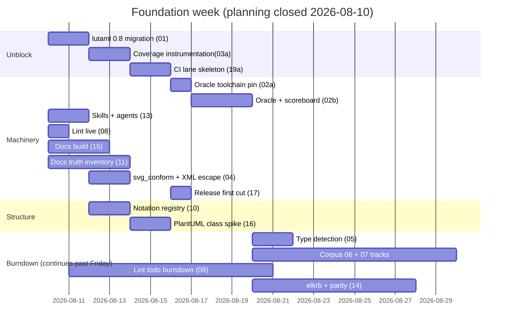
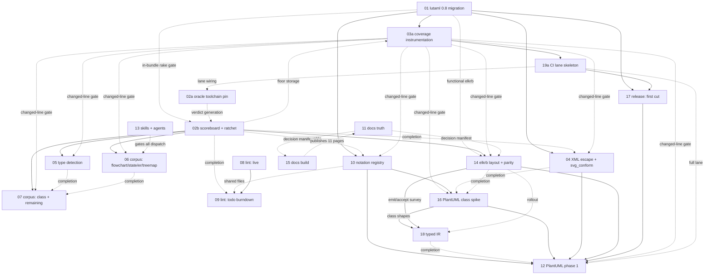

# Sirena Foundation Plan (rev 7)

**Date**: 2026-08-11. Revised after a maximum-effort adversarial audit
that re-derived every claim from live commands. What changed in rev 7:
three items split into gated halves (02a/02b, 03a/03b, 19a/19b), item
06's shared-grammar work serialized onto its own track, the oracle
toolchain made hermetic, missing completion edges recorded, and several
factually wrong premises corrected.
**Goal**: make the base flawless AND ship visible results fast — every
track runs in parallel; strict bars are finish lines the machinery
grinds toward, locked so scores never regress.

> Local working docs referenced as `docs/plans/*` live only on the
> maintainer's machine. The plan files are self-contained.

## The week

Gantt scope note: week-scope only — items 12, 18, 19b, 03b's later
floor raises, and item 17's second release cut (the one made after
items 10 and 16 land) are not drawn; the items table below is the
authoritative list.

Weekend milestone: the repo status goes to the issue-#2 author (the
user sends it; the plan's owner prepares the evidence). Evidence
checklist, each item verified before the status goes out:
- [ ] clean clone → `bundle install` → `bundle exec rake` green
- [ ] every README command works as typed (snippet spec output attached)
- [ ] docs site builds; no measured-false claim on any page
- [ ] CI green with the gates visible in the checks list
- [ ] an installable 0.x release (item 17 first cut)
- [ ] the PlantUML class spike renders a demo `.puml` (the surprise)
Rule: **everything he can touch must work perfectly** — fewer things in
perfect condition beat many things half-done.

## Track topology (what blocks what)

Solid arrows = **start blockers**; a label on one names the *part* of the
source that gates the start, so the target waits for that part rather than
for the whole item. Dotted arrows = partial edges — an item may START, but
cannot CLOSE (or cannot run one named part) until the source lands. A pair
may carry both, as 14 → 18 does: the survey gates 18's start, the rollout
gates its close. Transitive edges are omitted (e.g. 01 and 02
reach 12 through 04/14/16/17). The items table below is the
authoritative "can start" list.

11 and 15 point at each other, and that is not a cycle: 11 hands 15 the
dispositions it needs to resolve ghost links, and 15 later publishes the
corrected pages 11 produced. Different artifacts, different moments —
neither waits on the other to start.

**One global rule the arrows cannot express: no builder is dispatched
before item 13's bootstrap and start-guard land.** Item 13 exists so a
dispatched agent inherits the bars without being told, and its guard
aborts when the tooling is missing. A track that dispatches into an
unguarded fresh worktree gets an agent that has read none of it — which
is the failure item 13 was written to prevent, and it applies to every
track, not just item 06. Design, investigation and hand-written work
start whenever their own dependencies allow; only DISPATCH waits.

Everything without an arrow between them runs in parallel.
PlantUML phase 1 (12) still waits on 01, 02, 04, 10, 14, 16, 17 in
full, plus two partial prerequisites named in item 12: 19a and 03a. Lint
completion (09), coverage completion (03b), the docs truth pass (11) and
the corpus long tail do NOT block it — they run alongside, to their own
finish lines.

**Wave-1 CI ownership.** Read "starts", "first workflow edit" and
"closes" as three different things. 01's migration lands first and
touches no CI at all; 03a follows with rake tasks only; 19a is the FIRST
workflow edit and owns those files from then on. 17 opens once 19a has
pinned the release workflow, and item 01 CLOSES after 19a gives it a
lane.

Six items eventually want CI entries — 01 (fresh-resolution job), 02
(oracle toolchain + corpus), 08 (rubocop), 11 (snippet spec), 15 (docs
build + link checker) and 19 itself. 13 starts in the wave but touches
no workflow. Everyone after 19a ships local commands or rake tasks plus
one lane entry through
19a's extension contract.

## The bars (user-ruled 2026-08-10; never lowered, timeline-staged)

| Measure | Today | Finish line | How it gets there |
|---|---|---|---|
| Corpus per type | 30.7% overall (614/1997) | **100% of oracle-valid** | oracle = the hermetically pinned toolchain (item 02a: Node + mermaid-cli + mermaid + Puppeteer + Chromium + fonts) renders it; per-case ratchet; parallel per-type burndown |
| Coverage (line) | ~86% | **97% gate, 100 aspiration** | floor set at 92 once item 03's initial test pass closes the 86→92 gap (pass first, so the gate never lands red); new code always 100% |
| Coverage (branch) | ~55% | **97%** | staged timeline: 70 → 80 → 90 → 97, each step tied to a track completing; never lowered |
| Lint todo | 7,614 parked | **file deleted** | zero live always; monotone shrink; only tiny user-signed metrics exclusions survive in main config |
| Layout parity | not measured | invariants **hard**; geometry 8%/15% target | per-case geometry ratchet; a type renegotiates only with evidence, user decides; bar raises later |
| SVG conformance | all samples fail; output is not XML-escaped at all | **100% valid under chosen profile, all output parseable XML** | escape at one boundary in `lib/sirena/svg/`; no runtime auto-fix; conformant by construction |
| Docs | build exits 0 but the published site is incomplete and broken; false claims throughout | **builds complete; zero unverified claims** | numbers generated from the scoreboard, not hand-written |

Universal: zero High/Medium findings reach any PR (nitpicks count);
full Pre-Push Review Chain per PR; a case leaves a denominator only if
the oracle itself rejects its input — never by human judgment.

## One scoreboard, one guard

All ratchets live in ONE mechanism (owned by item 02):
`scoreboard/` — per-case and per-metric expected values; CI diffs the
working tree against the **merge-base** copy; any regression fails, any
improvement not recorded fails (stale). Corpus (02), conformance (04),
lint debt (09), coverage floors (03), and parity (14) are columns in
it, not five bespoke systems.

Two rules that make it real:

- **Per-case rows, not aggregate counts**, wherever a count could hide
  a swap. Conformance and parity store one row per case; totals are
  derived. A count-only column lets one fix pay for one break.
- **Case identity is stable** — derived from upstream path + test
  identity + source hash, never from ordinal position. Ordinal IDs turn
  one upstream insertion into mass deletion plus mass creation, and the
  ratchet reads noise instead of regressions.

## Items

| # | Item | Can start |
|---|---|---|
| 01 | lutaml-model 0.8 migration (in-repo; elkrb resolves already) | now — lands FIRST; nothing is green before it |
| 02a | Hermetic oracle toolchain pin | design now; lands after 19a provides the lane |
| 02b | Corpus oracle verdicts, provenance, scoreboard | design now; verdicts after 02a (in-bundle gates need 01) |
| 03a | Coverage instrumentation + changed-line gate | after 01's migration (only floor storage waits for 02) |
| 03b | Coverage floor timeline + completion pass | after 03a, tied to named events |
| 04 | XML escaping + svg_conform gate | after 01; completes after 02 |
| 05 | Type detection fixes | after 02 |
| 06 | Corpus burndown: flowchart, state, er, treemap | after 02 (type-local parallel; common.rb serialized) |
| 07 | Corpus burndown: class + all remaining types | after 02 (same rule); all-types claim closes with 05+06 |
| 08 | Lint: zero live offenses + CI enforcement | now |
| 09 | Lint: todo burndown to deletion | after 08; completes after 02; item-10 files after 10 |
| 10 | Notation registry (two-level) | after 01 |
| 11 | Docs truth (generated numbers) | now (publishing waits for 15) |
| 12 | PlantUML phase 1: class then sequence | after 01,02,04,10,14,16,17 + 19a, 03a |
| 13 | Skills + agents + worktree bootstrap | now |
| 14 | elkrb integration + layout parity | design after 02; integration after 01+02 |
| 15 | Docs site build integrity | now |
| 16 | PlantUML class spike (registry proof) | after 10; completes after 04 + 14's comparator |
| 17 | Release + versioning (0.x) | after 19a (which follows 01) |
| 18 | Typed IR boundary | after 10, 14's survey and 16's spike; completes after 14's rollout; gates 12's Done |
| 19a | CI lane skeleton + external pins | after 01's migration and 03a — the suite must be green before lanes can be |
| 19b | CI consolidation + measured budgets | after the owned gates exist |
