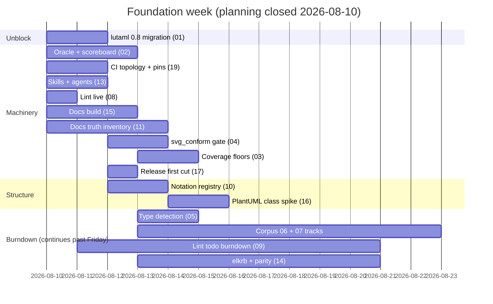
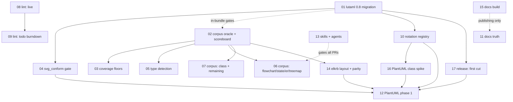

# Sirena Foundation Plan (rev 6)

**Date**: 2026-08-10. Rewritten after a fresh-eyes review round.
**Goal**: make the base flawless AND ship visible results fast — every
track runs in parallel; strict bars are finish lines the machinery
grinds toward, locked so scores never regress.

> Local working docs referenced as `docs/plans/*` live only on the
> maintainer's machine. The plan files are self-contained.

## The week

Gantt scope note: week-scope only — items 12, 18, and item 17's second
release cut (the one made after items 10 and 16 land) are not drawn;
the items table below is the authoritative list.

Weekend milestone: the repo status goes to the issue-#2 author (the
user sends it; the plan's owner prepares the evidence). Evidence
checklist, each item verified before the status goes out:
- [ ] clean clone → `bundle install` → `bundle exec rake` green
- [ ] every README command works as typed (snippet spec output attached)
- [ ] docs site builds; no measured-false claim on any page
- [ ] CI green with the gates visible in the checks list
- [ ] an installable 0.x release (item 17 first cut)
- [ ] the PlantUML class spike renders a demo `.puml` (the surprise)
Rule: **everything he can touch must work perfectly** — fewer things in
perfect condition beat many things half-done.

## Track topology (what blocks what)

Solid arrows = direct blockers (transitive edges omitted: e.g. 01 and
02 reach 12 through 04/14/16/17). Dotted arrows = labeled partial
edges (influence, or a dependency of only the named part — not a
start blocker). The items table below is the authoritative "can start"
list.

Everything without an arrow between them runs in parallel.
PlantUML phase 1 (12) waits ONLY for: 01, 02, 04, 10, 14, 16, 17.
Lint completion (09), coverage completion (03), docs truth (11), and the
corpus long tail do NOT block it — they run alongside, to their own
finish lines.

## The bars (user-ruled 2026-08-10; never lowered, timeline-staged)

| Measure | Today | Finish line | How it gets there |
|---|---|---|---|
| Corpus per type | 30.7% overall (614/1997) | **100% of oracle-valid** | oracle = pinned mmdc renders it; per-case ratchet; parallel per-type burndown |
| Coverage (line) | ~86% | **97% gate, 100 aspiration** | floor set at 92 once item 03's initial test pass closes the 86→92 gap (pass first, so the gate never lands red); new code always 100% |
| Coverage (branch) | ~55% | **97%** | staged timeline: 70 → 80 → 90 → 97, each step tied to a track completing; never lowered |
| Lint todo | 7,614 parked | **file deleted** | zero live always; monotone shrink; only tiny user-signed metrics exclusions survive in main config |
| Layout parity | not measured | invariants **hard**; geometry 8%/15% target | per-case geometry ratchet; a type renegotiates only with evidence, user decides; bar raises later |
| SVG conformance | all samples fail | **100% valid under chosen profile** | no runtime auto-fix; conformant by construction |
| Docs | unbuildable, false claims | **builds; zero unverified claims** | numbers generated from the scoreboard, not hand-written |

Universal: zero High/Medium findings reach any PR (nitpicks count);
full Pre-Push Review Chain per PR; a case leaves a denominator only if
the oracle itself rejects its input — never by human judgment.

## One scoreboard, one guard

All ratchets live in ONE mechanism (owned by item 02):
`scoreboard/` — per-case and per-metric expected values; CI diffs the
working tree against the **merge-base** copy; any regression fails, any
improvement not recorded fails (stale). Corpus (02), conformance (04),
lint debt (09), coverage floors (03), and parity (14) are columns in
it, not five bespoke systems.

## Items

| # | Item | Can start |
|---|---|---|
| 01 | lutaml-model 0.8 migration (in-repo; elkrb resolves already) | now |
| 02 | Corpus oracle, provenance, scoreboard | now (in-bundle gates need 01; pin workaround until then) |
| 03 | Coverage floors + branch timeline | after 02 |
| 04 | svg_conform gate | after 01 |
| 05 | Type detection fixes | after 02 |
| 06 | Corpus burndown: flowchart, state, er, treemap | after 02 (per-type parallel) |
| 07 | Corpus burndown: class + all remaining types | after 02 (per-type parallel) |
| 08 | Lint: zero live offenses + CI enforcement | now |
| 09 | Lint: todo burndown to deletion | after 08 |
| 10 | Notation registry (two-level) | after 01 |
| 11 | Docs truth (generated numbers) | now (publishing waits for 15) |
| 12 | PlantUML phase 1: class then sequence | after 01,02,04,10,14,16,17 |
| 13 | Skills + agents (AGENTS.md first) | now |
| 14 | elkrb integration + layout parity | after 02 |
| 15 | Docs site build integrity | now |
| 16 | PlantUML class spike (registry proof) | after 10 |
| 17 | Release + versioning (0.x) | after 01 |
| 18 | Typed-IR boundary (stub for the next phase) | design-only |
| 19 | CI topology, runtime budget, external pins | now |
