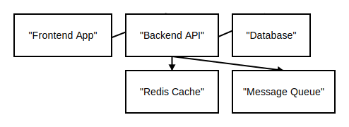

= Block Diagram Examples

== Purpose

Block diagrams provide a flexible way to visualize system components and their relationships using a column-based layout. They are ideal for showing architectural overviews, data flows, and component interactions with spatial organization.

== When to Use

* System architecture and component layout
* Data flow and pipeline visualization
* Infrastructure and deployment diagrams
* Microservices architecture overview
* Multi-tier application structure

== Syntax Overview

[source,mermaid]
----
block-beta
    columns 3
    
    Frontend["Frontend"]
    Backend["Backend"]
    Database["Database"]
    
    Frontend --> Backend
    Backend --> Database
----

**Layout**: `columns N` - Define column-based grid layout

**Block Types**:
- `Label["Text"]` - Basic block
- `Label(("Text"))` - Circle block
- `Label{{"Text"}}` - Hexagon block
- `Label[["Text"]]` - Subroutine block
- `space` - Empty cell

**Connections**:
- `-->` - Arrow connection between blocks
- Multi-line connections for complex flows

**Compound Blocks**: Group related blocks together

== Examples

=== 01: Basic Blocks

Demonstrates a simple architecture layout with frontend, backend, database, cache, and message queue components connected in a column-based grid.

**File**: link:01-basic-blocks.mmd[01-basic-blocks.mmd]

[source,mermaid]
----
include::01-basic-blocks.mmd[]
----

== Features Demonstrated

[%header,cols="1,1"]
|===
| Feature | Example

| Column-based layout
| 01

| Basic blocks
| 01

| Block connections
| 01

| Space elements
| 01

| Multi-component architecture
| 01
|===

== Additional Resources

* link:../../README.adoc[Main Documentation]
* https://mermaid.js.org/syntax/block.html[Mermaid Block Diagram Documentation]