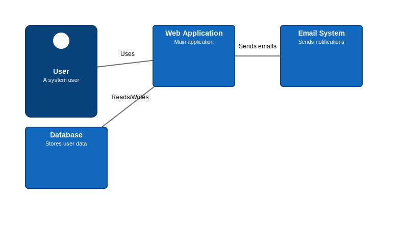

= C4 Diagram Examples

== Purpose

C4 diagrams provide a hierarchical approach to software architecture visualization through four levels: Context, Container, Component, and Code. They help communicate system architecture to different audiences with varying levels of technical detail.

== When to Use

* Software system architecture documentation
* Microservices and distributed system design
* System context and external dependencies
* Container-level deployment architecture
* Component-level internal structure

== Syntax Overview

[source,mermaid]
----
C4Context
    title System Context
    
    Person(user, "User", "System user")
    System(app, "Application", "Main system")
    System_Ext(ext, "External", "External system")
    
    Rel(user, app, "Uses")
    Rel(app, ext, "Calls")
----

**Element Types**:
- `Person(id, label, descr)` - User/actor
- `System(id, label, descr)` - Internal system
- `System_Ext(id, label, descr)` - External system
- `SystemDb(id, label, descr)` - Database
- `Container(id, label, tech, descr)` - Container
- `Component(id, label, tech, descr)` - Component

**Relationships**:
- `Rel(from, to, label)` - Basic relationship
- `Rel(from, to, label, tech)` - With technology
- `BiRel()` - Bidirectional relationship

**Boundaries**:
- `Boundary(id, label)` - Group elements
- `System_Boundary()` - System boundary
- `Enterprise_Boundary()` - Enterprise boundary

== Examples

=== 01: Context Diagram

Demonstrates a system context view showing users, the main application, and external dependencies with their relationships.

**File**: link:01-context-diagram.mmd[01-context-diagram.mmd]

[source,mermaid]
----
include::01-context-diagram.mmd[]
----

== Features Demonstrated

[%header,cols="1,1"]
|===
| Feature | Example

| Person/User definition
| 01

| System definition
| 01

| External systems
| 01

| Database systems
| 01

| Basic relationships
| 01

| Diagram titles
| 01
|===

== Additional Resources

* link:../../README.adoc[Main Documentation]
* https://c4model.com/[C4 Model Official Site]
* https://mermaid.js.org/syntax/c4.html[Mermaid C4 Diagram Documentation]