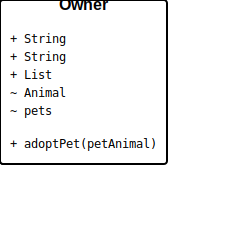

= Class Diagram Examples

== Purpose

Class diagrams visualize the structure of object-oriented systems, showing classes, their attributes, methods, and relationships. They are fundamental for software design, architecture documentation, and understanding system structure.

== When to Use

* Object-oriented design and architecture documentation
* Data model and entity relationship visualization
* Interface and abstract class hierarchies
* Design pattern documentation
* System structure and component relationships

== Syntax Overview

[source,mermaid]
----
classDiagram
    class Animal {
        +String name
        +int age
        +makeSound() void
    }
    
    class Dog {
        +String breed
        +bark() void
    }
    
    Animal <|-- Dog
----

**Class Definition**: Define classes with attributes and methods

**Visibility**:
- `+` - Public
- `-` - Private
- `#` - Protected
- `~` - Package/Internal

**Relationship Types**:
- `<|--` - Inheritance
- `*--` - Composition
- `o--` - Aggregation
- `-->` - Association
- `..>` - Dependency
- `..|>` - Realization

== Examples

=== 01: Basic Classes

Demonstrates a complete class hierarchy with inheritance, showing the Animal base class with Mammal and Bird subclasses, and an Owner class with composition.

**File**: link:01-basic-classes.mmd[01-basic-classes.mmd]

[source,mermaid]
----
include::01-basic-classes.mmd[]
----

== Features Demonstrated

[%header,cols="1,1"]
|===
| Feature | Example

| Class definition with attributes
| 01

| Methods and signatures
| 01

| Inheritance relationships
| 01

| Association with cardinality
| 01

| Multi-level hierarchy
| 01

| Generic types
| 01
|===

== Additional Resources

* link:../../README.adoc[Main Documentation]
* https://mermaid.js.org/syntax/classDiagram.html[Mermaid Class Diagram Documentation]