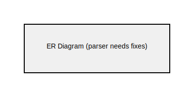
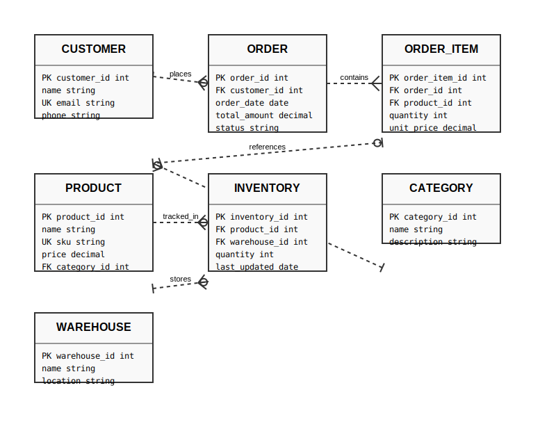

= Entity-Relationship Diagram Examples

== Purpose

Entity-Relationship (ER) diagrams model database schemas, showing entities (tables), their attributes, and the relationships between them. Essential for database design and documentation.

== When to Use

* Database schema design and documentation
* Data modeling and normalization
* System architecture planning
* Understanding existing database structures
* Communicating data requirements

== Syntax Overview

[source,mermaid]
----
erDiagram
    CUSTOMER ||--o{ ORDER : places
    ORDER ||--|{ LINE-ITEM : contains
    PRODUCT ||--o{ LINE-ITEM : "ordered in"
----

**Cardinality Notation**:
- `||--||` - Exactly one
- `}o--o{` - Zero or more (many)
- `||--o{` - One to many
- `}o--||` - Many to one

**Relationship Types**:
- Identifying relationships (solid line)
- Non-identifying relationships (dashed line)

== Examples

=== 01: Basic Entities

Demonstrates fundamental ER diagram with simple entities and relationships.

**File**: link:01-basic-entities.mmd[01-basic-entities.mmd]

[source,mermaid]
----
include::01-basic-entities.mmd[]
----

=== 02: Cardinality

Showcases all relationship cardinalities: one-to-one, one-to-many, many-to-many.

**File**: link:02-cardinality.mmd[02-cardinality.mmd]

[source,mermaid]
----
include::02-cardinality.mmd[]
----

== Features Demonstrated

[%header,cols="1,1"]
|===
| Feature | Example

| Basic entity definition
| 01, 02

| One-to-many relationships
| 01, 02

| Many-to-many relationships
| 02

| Relationship labels
| 01, 02

| Cardinality notation
| 02
|===

== Additional Resources

* link:../../README.adoc[Main Documentation]
* https://mermaid.js.org/syntax/entityRelationshipDiagram.html[Mermaid ER Diagram Documentation]
