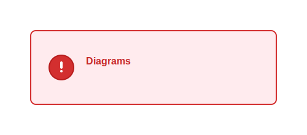
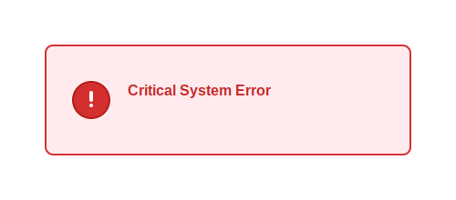

= Error Diagram Examples

== Purpose

Error diagrams display error messages and alerts in a standardized format within documentation.

== When to Use

* Error message documentation
* Alert visualization
* Warning displays
* Exception documentation
* Issue tracking displays

== Syntax Overview

[source,mermaid]
----
error
    title Error Message
    Error: Something went wrong
    Details: Additional context
----

== Examples

=== 01: Basic Error

Demonstrates basic error message display.

**File**: link:01-basic-error.mmd[01-basic-error.mmd]

[source,mermaid]
----
include::01-basic-error.mmd[]
----

=== 02: Error Display

Showcases detailed error with context.

**File**: link:02-error-display.mmd[02-error-display.mmd]

[source,mermaid]
----
include::02-error-display.mmd[]
----

== Features Demonstrated

[%header,cols="1,1"]
|===
| Feature | Example

| Error messages
| 01, 02

| Title display
| 01, 02

| Error details
| 02
|===

== Additional Resources

* link:../../README.adoc[Main Documentation]
