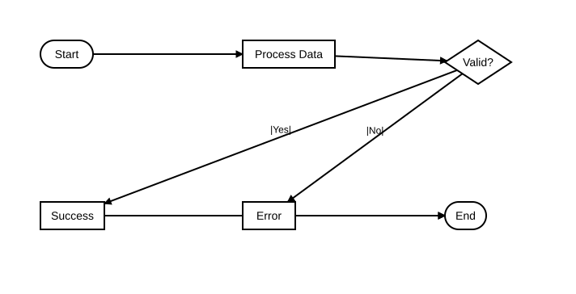
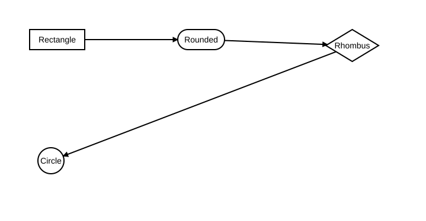
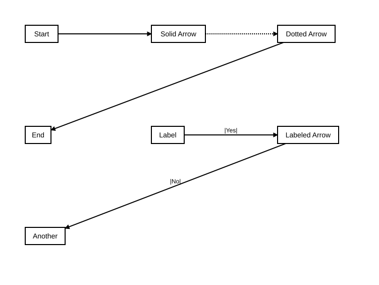
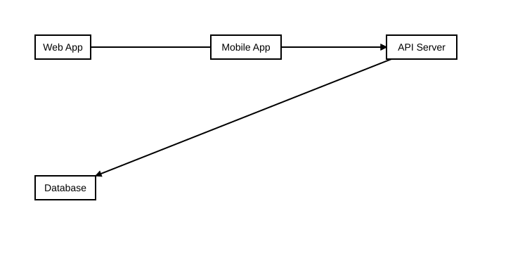
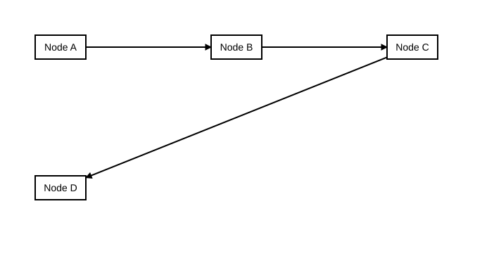
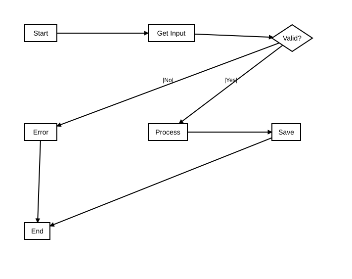

= Flowchart Examples

== Purpose

Flowcharts visualize processes, workflows, and decision trees using nodes and directed edges. They are ideal for representing algorithms, business processes, and system logic flows.

== When to Use

* Process documentation and standard operating procedures
* Algorithm visualization and pseudocode representation  
* Decision tree mapping and workflow design
* System flow diagrams and state transitions
* Business process modeling (BPM)

== Syntax Overview

[source,mermaid]
----
graph TD
    A[Rectangle Node]
    B{Decision Node}
    C([Rounded Node])
    
    A --> B
    B -->|Yes| C
    B -->|No| A
----

**Direction**: `TD` (top-down), `LR` (left-right), `BT` (bottom-top), `RL` (right-left)

**Node Shapes**:
- `[text]` - Rectangle
- `(text)` - Rounded rectangle
- `([text])` - Stadium/pill shape
- `[[text]]` - Subroutine
- `[(text)]` - Database/cylinder
- `((text))` - Circle
- `{text}` - Rhombus/decision
- `{{text}}` - Hexagon

**Edge Types**:
- `-->` - Arrow
- `---` - Line
- `-.->` - Dotted arrow
- `-.-` - Dotted line
- `==>` - Thick arrow
- `===` - Thick line

== Examples

=== 01: Basic Flow

Demonstrates fundamental flowchart structure with start/end nodes, process steps, and decision points.

**File**: link:01-basic-flow.mmd[01-basic-flow.mmd]

[source,mermaid]
----
include::01-basic-flow.mmd[]
----

=== 02: Node Shapes

Showcases four node shapes (rectangle, rounded, rhombus, circle); see the Syntax
Overview above for the full set Sirena supports.

**File**: link:02-node-shapes.mmd[02-node-shapes.mmd]

[source,mermaid]
----
include::02-node-shapes.mmd[]
----

=== 03: Edge Types

Demonstrates solid, dotted, and labeled arrow edges (not plain lines or thick edges).

**File**: link:03-edge-types.mmd[03-edge-types.mmd]

[source,mermaid]
----
include::03-edge-types.mmd[]
----

=== 04: Subgraphs

Shows a service dependency chain (web/mobile clients through an API server to a
database); it does not yet use Mermaid's `subgraph` grouping syntax.

**File**: link:04-subgraphs.mmd[04-subgraphs.mmd]

[source,mermaid]
----
include::04-subgraphs.mmd[]
----

=== 05: Styling

Shows a simple linear node chain; it does not yet demonstrate `classDef` or
`linkStyle` custom styling.

**File**: link:05-styling.mmd[05-styling.mmd]  

[source,mermaid]
----
include::05-styling.mmd[]
----

=== 06: Complex Flow

Demonstrates a realistic complex workflow with multiple paths, error handling, and state management.

**File**: link:06-complex-flow.mmd[06-complex-flow.mmd]

[source,mermaid]  
----
include::06-complex-flow.mmd[]
----

== Features Demonstrated

[%header,cols="1,1"]
|===
| Feature | Example

| Basic node and edge creation
| 01

| Basic node shapes
| 02

| Solid, dotted, and labeled edges
| 03

| Service dependency chain
| 04

| Linear node chain
| 05

| Complex multi-path workflows
| 06

| Decision points and branching
| 01, 06

| Error handling patterns
| 01, 06

| Process loops
| 06
|===

== Additional Resources

* link:../../README.adoc[Main Documentation]
* link:../../docs/_diagram_types/flowchart.adoc[Flowchart Full Reference]
* https://mermaid.js.org/syntax/flowchart.html[Mermaid Flowchart Documentation]