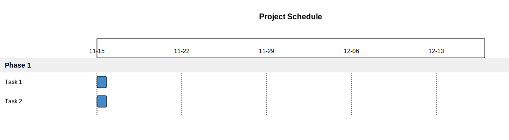

= Gantt Chart Examples

== Purpose

Gantt charts visualize project schedules, showing tasks, their durations, dependencies, and milestones over time. Essential for project management and timeline planning.

== When to Use

* Project planning and scheduling
* Task dependency visualization
* Resource allocation planning
* Timeline communication with stakeholders
* Progress tracking and reporting

== Syntax Overview

[source,mermaid]
----
gantt
    title Project Schedule
    dateFormat YYYY-MM-DD
    section Phase 1
    Task 1 :a1, 2024-01-01, 30d
    Task 2 :after a1, 20d
----

**Date Formats**: `YYYY-MM-DD`, `YYYY-MM-DD HH:mm`

**Task Dependencies**:
- `after taskId` - Start after another task
- `taskId, duration` - Explicit duration

== Examples

=== 01: Simple Timeline

Demonstrates basic Gantt chart with sequential tasks and sections.

**File**: link:01-simple-timeline.mmd[01-simple-timeline.mmd]

[source,mermaid]
----
include::01-simple-timeline.mmd[]
----

=== 02: Task Dependencies

Showcases task dependencies and parallel execution paths.

**File**: link:02-task-dependencies.mmd[02-task-dependencies.mmd]

[source,mermaid]
----
include::02-task-dependencies.mmd[]
----

image::02-task-dependencies.svg[]

== Features Demonstrated

[%header,cols="1,1"]
|===
| Feature | Example

| Basic task scheduling
| 01, 02

| Section grouping
| 01, 02

| Task dependencies
| 02

| Duration specification
| 01, 02

| Timeline visualization
| 01, 02
|===

== Additional Resources

* link:../../README.adoc[Main Documentation]
* https://mermaid.js.org/syntax/gantt.html[Mermaid Gantt Documentation]
