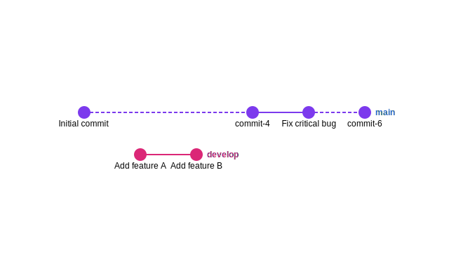

= Git Graph Examples

== Purpose

Git graph diagrams visualize Git repository history, showing commits, branches, merges, and tags in a timeline format.

== When to Use

* Visualizing Git branching strategies
* Documenting release workflows
* Teaching Git concepts
* Planning merge strategies
* Illustrating version control flows

== Syntax Overview

[source,mermaid]
----
gitGraph
    commit
    branch develop
    checkout develop
    commit
    checkout main
    merge develop
----

== Examples

=== 01: Linear History

Demonstrates basic Git history with sequential commits.

**File**: link:01-linear-history.mmd[01-linear-history.mmd]

[source,mermaid]
----
include::01-linear-history.mmd[]
----

=== 02: Branching

Showcases branching and merging workflows.

**File**: link:02-branching.mmd[02-branching.mmd]

image::02-branching.svg[]

== Features Demonstrated

[%header,cols="1,1"]
|===
| Feature | Example

| Linear commit history
| 01

| Branch creation
| 02

| Merge operations
| 02

| Multiple branches
| 02
|===

== Additional Resources

* link:../../README.adoc[Main Documentation]
* https://mermaid.js.org/syntax/gitgraph.html[Mermaid Git Graph Documentation]
