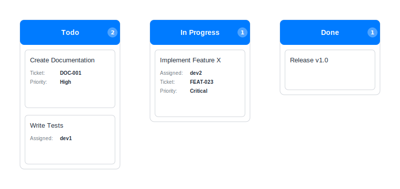

= Kanban Board Examples

== Purpose

Kanban boards visualize workflow status, showing tasks moving through different stages from backlog to completion.

== When to Use

* Agile project management
* Workflow visualization
* Task tracking and status monitoring
* Team collaboration
* Process optimization

== Syntax Overview

[source,mermaid]
----
kanban
    Todo
        Task 1
        Task 2
    In Progress
        Task 3
    Done
        Task 4
----

== Examples

=== 01: Simple Board

Demonstrates basic kanban board with three columns.

**File**: link:01-simple-board.mmd[01-simple-board.mmd]

[source,mermaid]
----
include::01-simple-board.mmd[]
----

=== 02: Workflow

Showcases complete workflow with multiple stages and tasks.

**File**: link:02-workflow.mmd[02-workflow.mmd]

[source,mermaid]
----
include::02-workflow.mmd[]
----

image::02-workflow.svg[]

== Features Demonstrated

[%header,cols="1,1"]
|===
| Feature | Example

| Basic board layout
| 01, 02

| Multiple columns
| 01, 02

| Task cards
| 01, 02

| Workflow stages
| 02
|===

== Additional Resources

* link:../../README.adoc[Main Documentation]
* https://mermaid.js.org/syntax/kanban.html[Mermaid Kanban Documentation]
