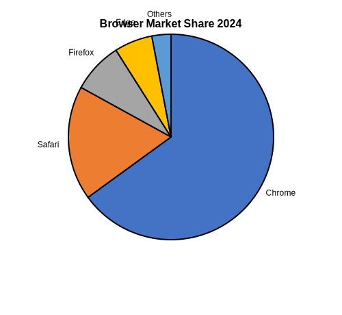

= Pie Chart Examples

== Purpose

Pie charts visualize proportional data, showing how individual parts contribute to a whole. Ideal for displaying percentages and relative distributions.

== When to Use

* Market share analysis
* Budget allocation visualization
* Survey result presentation
* Resource distribution
* Percentage breakdowns

== Syntax Overview

[source,mermaid]
----
pie title Sample Distribution
    "Category A" : 45
    "Category B" : 30
    "Category C" : 25
----

== Examples

=== 01: Simple Distribution

Demonstrates basic pie chart with labeled sections.

**File**: link:01-simple-distribution.mmd[01-simple-distribution.mmd]

[source,mermaid]
----
include::01-simple-distribution.mmd[]
----

image::01-simple-distribution.svg[]

=== 02: Labeled Slices

Showcases detailed pie chart with multiple categories.

**File**: link:02-labeled-slices.mmd[02-labeled-slices.mmd]

[source,mermaid]
----
include::02-labeled-slices.mmd[]
----

== Features Demonstrated

[%header,cols="1,1"]
|===
| Feature | Example

| Basic pie chart
| 01, 02

| Multiple categories
| 02

| Proportional visualization
| 01, 02

| Title display
| 01, 02
|===

== Additional Resources

* link:../../README.adoc[Main Documentation]
* https://mermaid.js.org/syntax/pie.html[Mermaid Pie Chart Documentation]
