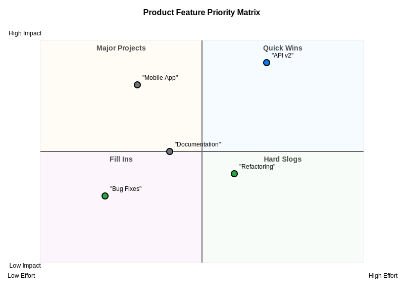
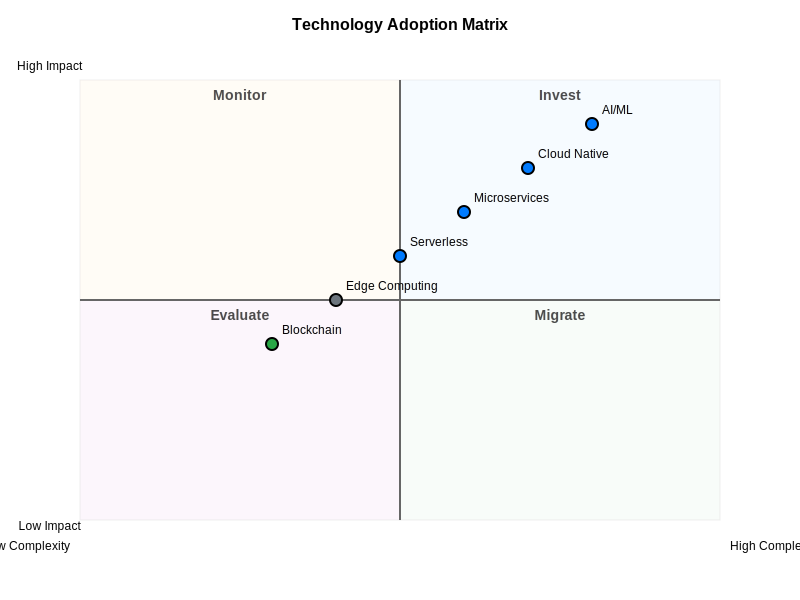

= Quadrant Chart Examples

== Purpose

Quadrant charts visualize data points in a 2D coordinate system divided into four quadrants, useful for categorizing items based on two dimensions.

== When to Use

* Technology adoption analysis (Gartner Magic Quadrant style)
* Risk assessment matrices
* Priority matrices (Eisenhower matrix)
* Portfolio analysis
* Feature prioritization

== Syntax Overview

[source,mermaid]
----
quadrantChart
    title Adoption Matrix
    x-axis Low --> High
    y-axis Low --> High
    quadrant-1 Invest
    quadrant-2 Monitor
    quadrant-3 Divest
    quadrant-4 Review
    Item A: [0.3, 0.6]
    Item B: [0.7, 0.8]
----

== Examples

=== 01: Basic Quadrant

Demonstrates basic quadrant chart with labeled axes and items.

**File**: link:01-basic-quadrant.mmd[01-basic-quadrant.mmd]

[source,mermaid]
----
include::01-basic-quadrant.mmd[]
----

=== 02: Positioned Items

Showcases complex quadrant with many positioned items.

**File**: link:02-positioned-items.mmd[02-positioned-items.mmd]

[source,mermaid]
----
include::02-positioned-items.mmd[]
----

== Features Demonstrated

[%header,cols="1,1"]
|===
| Feature | Example

| Basic quadrant layout
| 01, 02

| Item positioning
| 01, 02

| Axis labeling
| 01, 02

| Quadrant naming
| 01, 02

| Multiple data points
| 02
|===

== Additional Resources

* link:../../README.adoc[Main Documentation]
* https://mermaid.js.org/syntax/quadrantChart.html[Mermaid Quadrant Chart Documentation]
