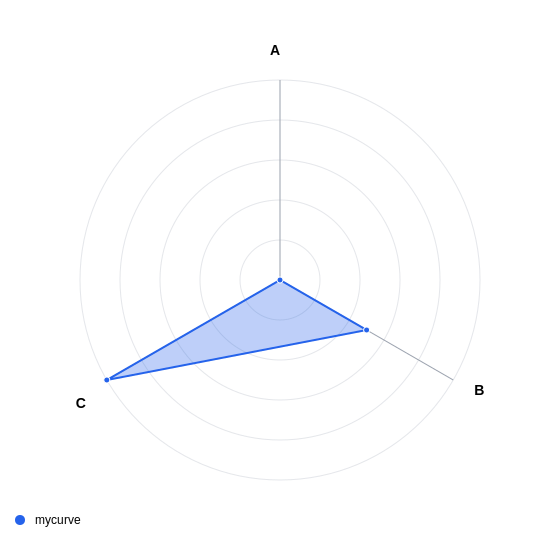
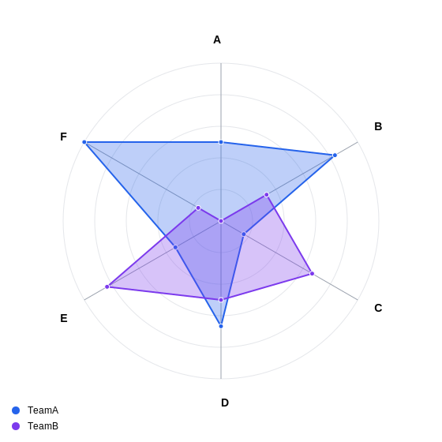

= Radar Chart Examples

== Purpose

Radar charts display multivariate data on axes starting from the same point, ideal for comparing multiple variables across different items.

== When to Use

* Skills assessment visualization
* Performance comparison
* Product feature analysis
* Multi-dimensional data comparison
* Capability matrixing

== Syntax Overview

[source,mermaid]
----
radar-beta
    axis Skill1,Skill2,Skill3
    curve TeamA{80,90,70}
    curve TeamB{60,85,75}
----

== Examples

=== 01: Simple Radar

Demonstrates basic radar chart with one data series.

**File**: link:01-simple-radar.mmd[01-simple-radar.mmd]

[source,mermaid]
----
include::01-simple-radar.mmd[]
----

=== 02: Multiple Curves

Showcases comparison of multiple datasets on radar chart.

**File**: link:02-multiple-curves.mmd[02-multiple-curves.mmd]

[source,mermaid]
----
include::02-multiple-curves.mmd[]
----

== Features Demonstrated

[%header,cols="1,1"]
|===
| Feature | Example

| Axis definition
| 01, 02

| Single curve
| 01

| Multiple curves
| 02

| Data comparison
| 02
|===

== Additional Resources

* link:../../README.adoc[Main Documentation]
* https://mermaid.js.org/syntax/radar.html[Mermaid Radar Documentation]
