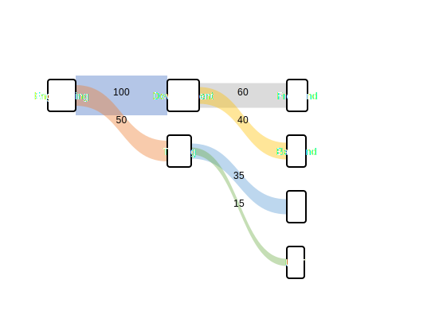
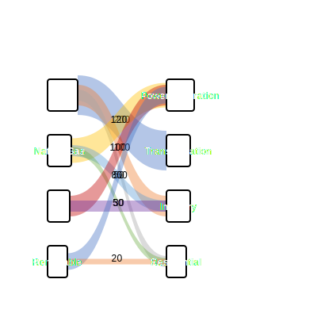

= Sankey Diagram Examples

== Purpose

Sankey diagrams visualize flow quantities between nodes, showing how values split and combine through a system.

== When to Use

* Energy flow visualization
* Resource allocation tracking
* Material flow analysis
* Budget distribution
* Process flow quantification

== Syntax Overview

[source,mermaid]
----
sankey-beta
    Source,Target,100
    Source,Another,50
----

== Examples

=== 01: Simple Flow

Demonstrates basic sankey diagram with flow relationships.

**File**: link:01-simple-flow.mmd[01-simple-flow.mmd]

[source,mermaid]
----
include::01-simple-flow.mmd[]
----

=== 02: Multi-Stage

Showcases complex multi-stage flow diagram.

**File**: link:02-multi-stage.mmd[02-multi-stage.mmd]

[source,mermaid]
----
include::02-multi-stage.mmd[]
----

== Features Demonstrated

[%header,cols="1,1"]
|===
| Feature | Example

| Basic flows
| 01, 02

| Flow quantities
| 01, 02

| Multi-stage flows
| 02

| Node relationships
| 01, 02
|===

== Additional Resources

* link:../../README.adoc[Main Documentation]
* https://mermaid.js.org/syntax/sankey.html[Mermaid Sankey Documentation]
