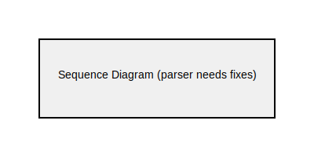

= Sequence Diagram Examples

== Purpose

Sequence diagrams visualize interactions between objects or components over time, showing the order of messages exchanged in a particular scenario. They are essential for documenting API workflows, system interactions, and communication protocols.

== When to Use

* API request/response flows and service interactions
* Authentication and authorization sequences
* Asynchronous message exchanges and event processing
* Transaction workflows and state changes
* System integration scenarios and data flows

== Syntax Overview

[source,mermaid]
----
sequenceDiagram
    participant Alice
    participant Bob
    
    Alice->>Bob: Hello Bob
    Bob-->>Alice: Hi Alice
    
    Note over Alice,Bob: Conversation
----

**Participants**: Define entities using `participant Name`

**Message Types**:
- `->>` - Solid arrow
- `-->>` - Dotted arrow (response)
- `->>+` - Activate lifeline
- `-->>-` - Deactivate lifeline

**Additional Elements**:
- `Note over A,B: Text` - Add notes
- `loop` - Repeating sequences
- `alt`/`else` - Conditional flows
- `par` - Parallel execution

== Examples

=== 01: Basic Sequence

Demonstrates a complete request/response flow with caching, showing participant interactions and activation/deactivation of lifelines.

**File**: link:01-basic-sequence.mmd[01-basic-sequence.mmd]

[source,mermaid]
----
include::01-basic-sequence.mmd[]
----

== Features Demonstrated

[%header,cols="1,1"]
|===
| Feature | Example

| Participant declaration
| 01

| Solid arrows (requests)
| 01

| Dotted arrows (responses)
| 01

| Activation/deactivation
| 01

| Notes
| 01

| Multi-step workflows
| 01
|===

== Additional Resources

* link:../../README.adoc[Main Documentation]
* https://mermaid.js.org/syntax/sequenceDiagram.html[Mermaid Sequence Diagram Documentation]