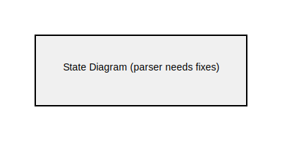

= State Diagram Examples

== Purpose

State diagrams visualize the behavior of a system by showing its states and the transitions between them. They are essential for modeling state machines, workflows, and system lifecycle management.

== When to Use

* System state machines and lifecycle management
* Connection and session state tracking
* User interface state flows
* Protocol state visualization
* Workflow and business process states

== Syntax Overview

[source,mermaid]
----
stateDiagram-v2
    [*] --> Idle
    
    Idle --> Active : start
    Active --> Idle : stop
    
    state Active {
        [*] --> Processing
        Processing --> Complete
    }
    
    Active --> [*]
----

**States**: Simple text labels or composite states with nested structure

**Transitions**: Arrows with optional labels showing triggers/conditions

**Special States**:
- `[*]` - Start/end state
- `state Name {...}` - Composite state with sub-states
- `state "Description" as Name` - State with description

**State Features**:
- Entry/exit actions
- Choice nodes
- Fork/join for parallel states

== Examples

=== 01: Simple States

Demonstrates a connection state machine with nested composite states, showing transitions, error handling, and complex state hierarchies.

**File**: link:01-simple-states.mmd[01-simple-states.mmd]

[source,mermaid]
----
include::01-simple-states.mmd[]
----

== Features Demonstrated

[%header,cols="1,1"]
|===
| Feature | Example

| Basic states and transitions
| 01

| Start and end states
| 01

| Transition labels
| 01

| Composite states
| 01

| Nested state hierarchies
| 01

| Multiple transition paths
| 01
|===

== Additional Resources

* link:../../README.adoc[Main Documentation]
* https://mermaid.js.org/syntax/stateDiagram.html[Mermaid State Diagram Documentation]