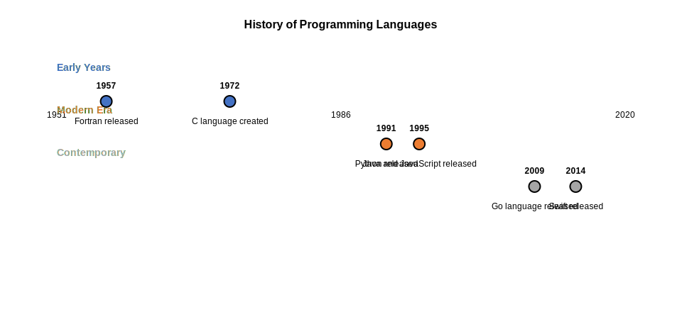
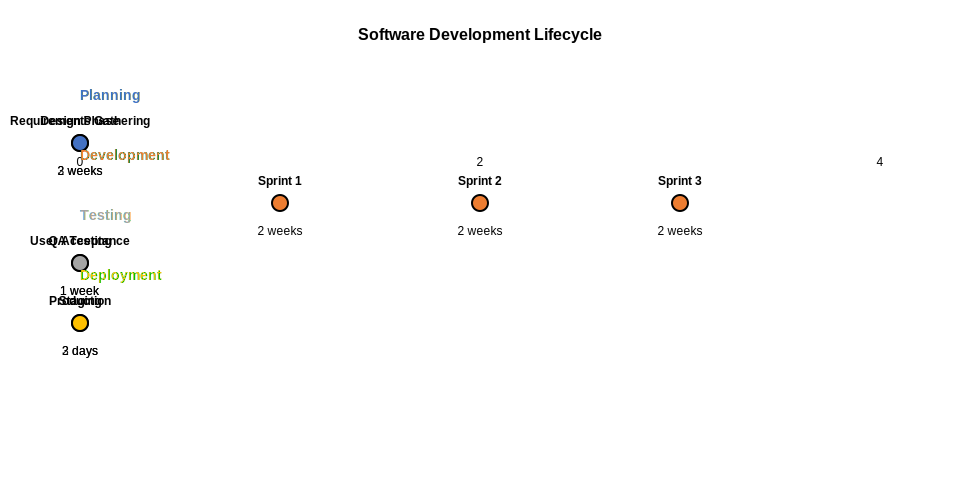

= Timeline Examples

== Purpose

Timeline diagrams visualize events chronologically, showing sequences of activities or milestones in temporal order.

== When to Use

* Project milestone visualization
* Historical event documentation
* Process chronology
* Planning phase transitions
* Event sequence mapping

== Syntax Overview

[source,mermaid]
----
timeline
    title Project Timeline
    section Phase 1
        Event 1
        Event 2
    section Phase 2
        Event 3
----

== Examples

=== 01: Simple Timeline

Demonstrates basic timeline with sequential events.

**File**: link:01-simple-timeline.mmd[01-simple-timeline.mmd]

[source,mermaid]
----
include::01-simple-timeline.mmd[]
----

=== 02: Periods

Showcases timeline with time periods and durations.

**File**: link:02-periods.mmd[02-periods.mmd]

[source,mermaid]
----
include::02-periods.mmd[]
----

== Features Demonstrated

[%header,cols="1,1"]
|===
| Feature | Example

| Basic timeline
| 01, 02

| Section grouping
| 01, 02

| Event sequencing
| 01, 02

| Period visualization
| 02
|===

== Additional Resources

* link:../../README.adoc[Main Documentation]
* https://mermaid.js.org/syntax/timeline.html[Mermaid Timeline Documentation]
