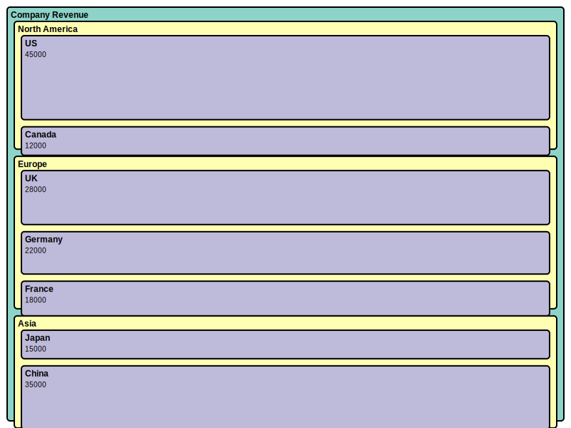

= Treemap Diagram Examples

== Purpose

Treemap diagrams display hierarchical data as nested rectangles, with size representing quantitative values.

== When to Use

* Disk space usage visualization
* Portfolio allocation
* Hierarchical data proportions
* Market share by category
* Resource distribution trees

== Syntax Overview

[source,mermaid]
----
treemap
    Root
        Child1: 40
        Child2: 60
----

== Examples

=== 01: Basic Treemap

Demonstrates basic treemap with hierarchical values.

**File**: link:01-basic-treemap.mmd[01-basic-treemap.mmd]

[source,mermaid]
----
include::01-basic-treemap.mmd[]
----

== Features Demonstrated

[%header,cols="1,1"]
|===
| Feature | Example

| Hierarchical structure
| 01

| Proportional sizing
| 01

| Nested categories
| 01
|===

== Additional Resources

* link:../../README.adoc[Main Documentation]
* https://mermaid.js.org/syntax/treemap.html[Mermaid Treemap Documentation]
