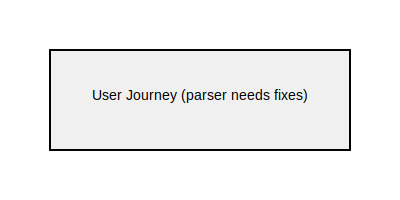
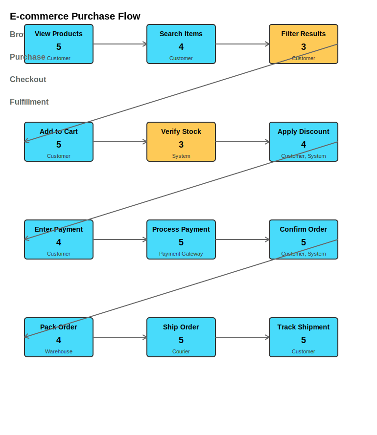

= User Journey Examples

== Purpose

User journey diagrams map user experiences and interactions with a system, showing tasks, satisfaction levels, and different actors involved in each step.

== When to Use

* User experience (UX) design
* Customer journey mapping
* Service design documentation
* Stakeholder engagement visualization
* Process improvement analysis

== Syntax Overview

[source,mermaid]
----
journey
    title My Journey
    section Section 1
        Task 1: 5: Actor 1
        Task 2: 3: Actor 1, Actor 2
----

**Satisfaction Levels**: 1 (low) to 5 (high)

== Examples

=== 01: Simple Journey

Demonstrates basic user journey with single actor and satisfaction scoring.

**File**: link:01-simple-journey.mmd[01-simple-journey.mmd]

[source,mermaid]
----
include::01-simple-journey.mmd[]
----

=== 02: Multi-Actor

Showcases complex journey with multiple actors and sections.

**File**: link:02-multi-actor.mmd[02-multi-actor.mmd]

[source,mermaid]
----
include::02-multi-actor.mmd[]
----

== Features Demonstrated

[%header,cols="1,1"]
|===
| Feature | Example

| Basic journey mapping
| 01, 02

| Satisfaction scoring
| 01, 02

| Multiple actors
| 02

| Section grouping
| 01, 02

| Task visualization
| 01, 02
|===

== Additional Resources

* link:../../README.adoc[Main Documentation]
* https://mermaid.js.org/syntax/userJourney.html[Mermaid User Journey Documentation]
