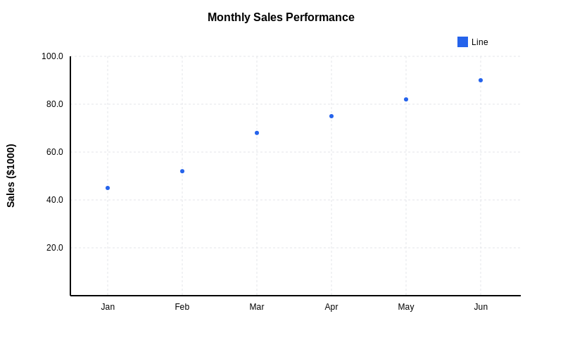

= XY Chart Examples

== Purpose

XY charts display data using x and y coordinates, supporting line and bar chart variations for trend visualization.

== When to Use

* Time series data visualization
* Statistical trend analysis  
* Performance metrics over time
* Comparative data analysis
* Revenue/sales tracking

== Syntax Overview

[source,mermaid]
----
xychart-beta
    title "Chart Title"
    x-axis [Q1, Q2, Q3, Q4]
    y-axis "Revenue" 0 --> 100
    line [20, 40, 60, 80]
    bar [15, 35, 55, 75]
----

== Examples

=== 01: Line Chart

Demonstrates basic XY line chart with labeled axes.

**File**: link:01-line-chart.mmd[01-line-chart.mmd]

[source,mermaid]
----
include::01-line-chart.mmd[]
----

=== 02: Bar Chart

Showcases bar chart variation with multiple series.

**File**: link:02-bar-chart.mmd[02-bar-chart.mmd]

[source,mermaid]
----
include::02-bar-chart.mmd[]
----

image::02-bar-chart.svg[]

== Features Demonstrated

[%header,cols="1,1"]
|===
| Feature | Example

| Line charts
| 01

| Bar charts
| 02

| Axis labeling
| 01, 02

| Multiple data series
| 02

| Value ranges
| 01, 02
|===

== Additional Resources

* link:../../README.adoc[Main Documentation]
* https://mermaid.js.org/syntax/xychart.html[Mermaid XY Chart Documentation]
